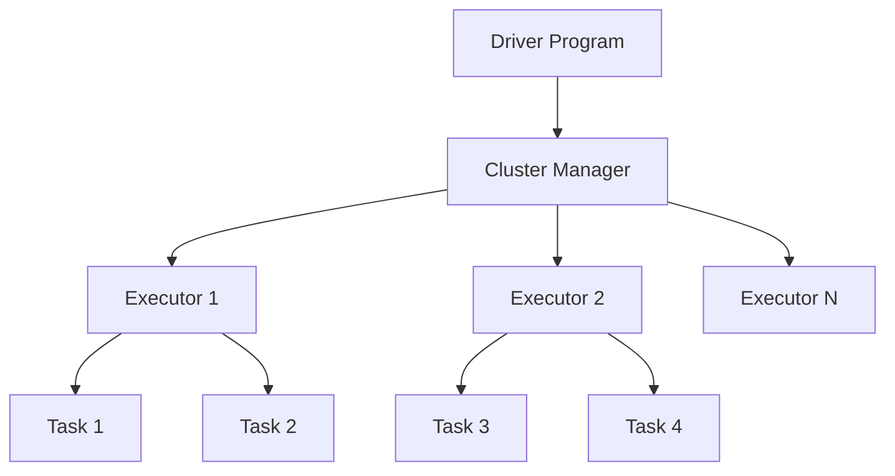

# Module 1: Apache Spark Core

## Overview
Apache Spark is a unified analytics engine for large-scale data processing. This module covers Spark's core architecture, fundamental concepts, and optimization techniques essential for the Databricks Certified Data Engineer Professional exam.

## Table of Contents
1. [Spark Architecture](#spark-architecture)
2. [RDD Fundamentals](#rdd-fundamentals)
3. [DataFrames and Datasets](#dataframes-and-datasets)
4. [Transformations and Actions](#transformations-and-actions)
5. [Caching and Persistence](#caching-and-persistence)
6. [Performance Optimization](#performance-optimization)
7. [Code Examples](#code-examples)
8. [Practice Questions](#practice-questions)
9. [Quick Reference](#quick-reference)

## Spark Architecture

### Cluster Architecture


### Key Components

| Component | Description | Responsibilities |
|-----------|-------------|-----------------|
| **Driver Program** | Main control process | Contains SparkContext, coordinates execution |
| **Cluster Manager** | Resource allocation | YARN, Standalone, Kubernetes, Mesos |
| **Executors** | Worker processes | Execute tasks, store data in memory/disk |
| **Tasks** | Units of work | Process partitions of data |

### Execution Model
- **Job**: Collection of transformations triggered by an action
- **Stage**: Set of tasks that can be executed in parallel
- **Task**: Unit of work executed on a single partition

## RDD Fundamentals

### Resilient Distributed Datasets (RDD)
RDDs are the fundamental data structure in Spark - immutable, distributed collections of objects.

#### Key Properties
- **Resilient**: Fault-tolerant through lineage tracking
- **Distributed**: Partitioned across cluster nodes
- **Dataset**: Collection of typed objects

#### Creating RDDs
```python
# From existing collection
data = [1, 2, 3, 4, 5]
rdd = spark.sparkContext.parallelize(data)

# From external data source
text_rdd = spark.sparkContext.textFile("hdfs://path/to/file.txt")

# From existing RDD
mapped_rdd = rdd.map(lambda x: x * 2)
```

#### RDD Lineage
- DAG (Directed Acyclic Graph) tracks transformations
- Enables fault recovery by recomputing lost partitions
- Use `.toDebugString()` to view lineage

## DataFrames and Datasets

### DataFrame API
DataFrames provide a higher-level abstraction with schema information and optimization through Catalyst.

#### Creating DataFrames
```python
# From RDD with schema
from pyspark.sql.types import StructType, StructField, StringType, IntegerType

schema = StructType([
    StructField("name", StringType(), True),
    StructField("age", IntegerType(), True)
])

df = spark.createDataFrame(rdd, schema)

# From data source
df = spark.read.format("parquet").load("path/to/file.parquet")
df = spark.read.option("header", "true").csv("path/to/file.csv")
```

### Datasets (Scala/Java)
Type-safe version of DataFrames available in Scala and Java.

### DataFrame vs RDD Comparison

| Aspect | RDD | DataFrame |
|--------|-----|-----------|
| **Type Safety** | Compile-time | Runtime |
| **Optimization** | Manual | Catalyst Optimizer |
| **Performance** | Lower | Higher (optimized) |
| **API** | Functional | SQL + Functional |
| **Schema** | No schema | Schema enforced |

## Transformations and Actions

### Narrow vs Wide Transformations

#### Narrow Transformations
No shuffling required - each input partition contributes to only one output partition.

```python
# Examples of narrow transformations
df.filter(col("age") > 25)
df.map(lambda x: x * 2)
df.select("name", "age")
df.withColumn("age_plus_one", col("age") + 1)
```

#### Wide Transformations
Require shuffling - input partitions contribute to multiple output partitions.

```python
# Examples of wide transformations
df.groupBy("department").count()
df.orderBy("age")
df.join(other_df, "key")
df.distinct()
```

### Common Transformations

| Transformation | Type | Description | Example |
|---------------|------|-------------|---------|
| `map()` | Narrow | Transform each element | `rdd.map(lambda x: x * 2)` |
| `filter()` | Narrow | Filter elements | `df.filter(col("age") > 25)` |
| `flatMap()` | Narrow | Flatten nested structures | `rdd.flatMap(lambda x: x.split(" "))` |
| `groupBy()` | Wide | Group by key | `df.groupBy("dept").count()` |
| `join()` | Wide | Join DataFrames | `df1.join(df2, "key")` |
| `union()` | Narrow | Combine DataFrames | `df1.union(df2)` |

### Actions

Actions trigger the execution of transformations and return results to the driver.

```python
# Common actions
df.collect()          # Return all rows to driver
df.count()           # Count number of rows
df.first()           # Return first row
df.take(10)          # Return first 10 rows
df.show()            # Display DataFrame content
df.write.parquet("path")  # Write to storage
```

## Caching and Persistence

### Storage Levels

| Storage Level | Description | Use Case |
|--------------|-------------|-----------|
| `MEMORY_ONLY` | Store in memory as deserialized objects | Default, fast access |
| `MEMORY_ONLY_SER` | Store in memory as serialized objects | Memory-efficient |
| `MEMORY_AND_DISK` | Store in memory, spill to disk | Fault-tolerant |
| `MEMORY_AND_DISK_SER` | Serialized version of above | Memory and fault-tolerant |
| `DISK_ONLY` | Store only on disk | Large datasets |

### Caching Best Practices

```python
# Cache DataFrame that's used multiple times
df_cached = df.filter(col("status") == "active").cache()

# Persist with specific storage level
from pyspark import StorageLevel
df.persist(StorageLevel.MEMORY_AND_DISK_SER)

# Check what's cached
spark.catalog.listTables()

# Unpersist when no longer needed
df_cached.unpersist()
```

### When to Cache
- DataFrame/RDD used multiple times
- Expensive computations (joins, aggregations)
- Iterative algorithms
- Interactive analysis

## Performance Optimization

### Catalyst Optimizer
- **Rule-based optimization**: Predicate pushdown, projection pushdown
- **Cost-based optimization**: Join reordering, statistics-based decisions
- **Code generation**: Whole-stage code generation for better CPU efficiency

### Optimization Techniques

#### 1. Partitioning
```python
# Repartition for balanced workload
df_repartitioned = df.repartition(200)

# Coalesce to reduce partitions (no shuffling)
df_coalesced = df.coalesce(50)

# Partition by column for efficient joins
df.write.partitionBy("year", "month").parquet("path")
```

#### 2. Join Optimization
```python
# Broadcast small tables
from pyspark.sql.functions import broadcast
large_df.join(broadcast(small_df), "key")

# Choose appropriate join types
df1.join(df2, "key", "inner")    # Inner join
df1.join(df2, "key", "left")     # Left outer join
```

#### 3. Predicate Pushdown
```python
# Good: Filter early
df.filter(col("year") == 2023).select("name", "value")

# Avoid: Filter late
df.select("name", "value").filter(col("year") == 2023)
```

#### 4. Column Pruning
```python
# Good: Select only needed columns
df.select("id", "name", "amount").groupBy("name").sum("amount")

# Avoid: Select all then aggregate
df.groupBy("name").sum("amount")  # Spark optimizes this anyway
```

### Memory Management
- Configure executor memory: `spark.executor.memory`
- Set memory fractions: `spark.sql.execution.arrow.pyspark.enabled`
- Monitor memory usage through Spark UI

## Code Examples

### Example 1: ETL Pipeline
```python
from pyspark.sql import SparkSession
from pyspark.sql.functions import *
from pyspark.sql.types import *

# Initialize Spark session
spark = SparkSession.builder \
    .appName("ETL Pipeline Example") \
    .config("spark.sql.adaptive.enabled", "true") \
    .getOrCreate()

# Read raw data
raw_df = spark.read \
    .option("header", "true") \
    .option("inferSchema", "true") \
    .csv("s3://bucket/raw-data/")

# Data cleaning and transformation
cleaned_df = raw_df \
    .filter(col("amount").isNotNull()) \
    .filter(col("amount") > 0) \
    .withColumn("processed_date", current_timestamp()) \
    .withColumn("year", year(col("transaction_date"))) \
    .withColumn("month", month(col("transaction_date")))

# Aggregation with window functions
from pyspark.sql.window import Window

window_spec = Window.partitionBy("customer_id").orderBy("transaction_date")

result_df = cleaned_df \
    .withColumn("running_total", 
                sum("amount").over(window_spec)) \
    .withColumn("transaction_rank", 
                row_number().over(window_spec))

# Write results
result_df \
    .repartition(10) \
    .write \
    .mode("overwrite") \
    .partitionBy("year", "month") \
    .parquet("s3://bucket/processed-data/")
```

### Example 2: Advanced Aggregations
```python
# Complex aggregations with multiple grouping levels
summary_df = df \
    .groupBy("department", "location") \
    .agg(
        count("employee_id").alias("employee_count"),
        avg("salary").alias("avg_salary"),
        max("hire_date").alias("latest_hire"),
        collect_list("employee_name").alias("employees")
    ) \
    .withColumn("avg_salary_rounded", round(col("avg_salary"), 2))

# Using window functions for ranking
window = Window.partitionBy("department").orderBy(desc("salary"))
ranked_df = df.withColumn("salary_rank", dense_rank().over(window))
```

### Example 3: Join Optimization
```python
# Efficient join with proper partitioning
large_df = spark.read.parquet("large_dataset/")
small_df = spark.read.parquet("lookup_table/")

# Cache small lookup table
small_df.cache()

# Broadcast join for small table
result = large_df \
    .join(broadcast(small_df), "common_key") \
    .select("large_df.*", "small_df.lookup_value")

# Bucketed join for large tables
large_df1.write \
    .bucketBy(10, "join_key") \
    .saveAsTable("bucketed_table1")

large_df2.write \
    .bucketBy(10, "join_key") \
    .saveAsTable("bucketed_table2")
```

## Practice Questions

### Question 1: RDD Transformations
**Q:** What is the output of the following RDD operations?
```python
rdd = spark.sparkContext.parallelize([1, 2, 3, 4, 5])
result = rdd.map(lambda x: x * 2).filter(lambda x: x > 5).collect()
```

**A:** `[6, 8, 10]`

**Explanation:** 
1. `map(lambda x: x * 2)` transforms [1,2,3,4,5] to [2,4,6,8,10]
2. `filter(lambda x: x > 5)` keeps only [6,8,10]
3. `collect()` returns the result to driver

### Question 2: Caching Strategy
**Q:** A DataFrame is used in multiple actions within a Spark application. The DataFrame requires expensive computations including joins and aggregations. What's the best caching strategy?

**A:** Use `.cache()` or `.persist(StorageLevel.MEMORY_AND_DISK)` after the expensive computations but before the multiple actions.

**Explanation:** Caching after expensive operations prevents recomputation. MEMORY_AND_DISK provides fault tolerance if memory is insufficient.

### Question 3: Join Optimization
**Q:** You need to join a 1TB dataset with a 10MB lookup table. What optimization should you use?

**A:** Use broadcast join with `broadcast(small_df)`

**Explanation:** Broadcasting the small table to all executors eliminates the need for shuffling the large dataset, significantly improving performance.

### Question 4: Partitioning
**Q:** What's the difference between `repartition()` and `coalesce()`?

**A:** 
- `repartition()`: Performs full shuffle, can increase or decrease partitions
- `coalesce()`: Minimizes data movement, only decreases partitions

**Use case:** Use `coalesce()` to reduce partitions after filtering, use `repartition()` for even distribution or to increase partitions.

### Question 5: Transformations vs Actions
**Q:** Classify these operations as transformations or actions:
- `df.filter(col("age") > 25)`
- `df.count()`
- `df.groupBy("dept").sum("salary")`
- `df.show()`

**A:** 
- `filter()`: Transformation (lazy)
- `count()`: Action (triggers execution)
- `groupBy().sum()`: Transformation (lazy)
- `show()`: Action (triggers execution)

## Quick Reference

### Essential Spark Configurations
```python
# Performance tuning configs
spark.conf.set("spark.sql.adaptive.enabled", "true")
spark.conf.set("spark.sql.adaptive.coalescePartitions.enabled", "true")
spark.conf.set("spark.sql.adaptive.skewJoin.enabled", "true")
spark.conf.set("spark.serializer", "org.apache.spark.serializer.KryoSerializer")
```

### Common DataFrame Operations Cheat Sheet

| Operation | Syntax | Description |
|-----------|--------|-------------|
| **Select** | `df.select("col1", "col2")` | Choose columns |
| **Filter** | `df.filter(col("age") > 25)` | Filter rows |
| **Group** | `df.groupBy("col").count()` | Aggregate operations |
| **Join** | `df1.join(df2, "key")` | Join DataFrames |
| **Order** | `df.orderBy("col")` | Sort data |
| **Distinct** | `df.distinct()` | Remove duplicates |
| **Union** | `df1.union(df2)` | Combine DataFrames |

### Performance Monitoring Commands
```python
# Check execution plan
df.explain(True)

# Check physical plan
df.explain("cost")

# View cached tables
spark.catalog.listTables()

# Clear cache
spark.catalog.clearCache()
```

### Key Takeaways for Certification Exam

1. **Understand the execution model**: Jobs → Stages → Tasks
2. **Know when to use caching**: Multiple actions on the same DataFrame
3. **Optimize joins**: Broadcast small tables, bucket large tables
4. **Manage partitions**: Balance parallelism and overhead
5. **Use Catalyst optimizer**: Let Spark optimize when possible
6. **Monitor performance**: Use Spark UI and explain plans
7. **Handle skewed data**: Use adaptive query execution features

---

**Next Module:** [Delta Lake](02_delta_lake.md)

**Resources:**
- [Apache Spark Documentation](https://spark.apache.org/docs/latest/)
- [Databricks Spark Guide](https://docs.databricks.com/spark/)
- [PySpark API Reference](https://spark.apache.org/docs/latest/api/python/)