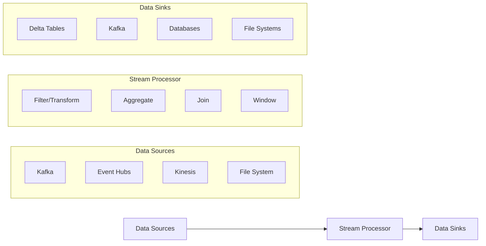

# Module 3: Streaming and Real-Time Processing

## Overview

Real-time data processing and streaming analytics are critical components of modern data architectures. This module covers Apache Spark Structured Streaming, streaming patterns, and integration with the Databricks Lakehouse platform. These concepts are essential for the Databricks Certified Data Engineer Professional exam.

## Key Learning Objectives

- Understand streaming fundamentals and architectures
- Master Spark Structured Streaming concepts and APIs
- Implement windowing, watermarking, and stateful operations
- Design robust streaming pipelines with error handling
- Optimize streaming performance and resource utilization
- Integrate streaming with Delta Lake for real-time analytics
- Monitor and troubleshoot streaming applications

## Table of Contents

1. [Streaming Fundamentals](#streaming-fundamentals)
2. [Structured Streaming Architecture](#structured-streaming-architecture)
3. [Input Sources and Output Sinks](#input-sources-and-output-sinks)
4. [Windowing Operations](#windowing-operations)
5. [Watermarking and Late Data](#watermarking-and-late-data)
6. [Stateful Operations](#stateful-operations)
7. [Stream-to-Stream Joins](#stream-to-stream-joins)
8. [Error Handling and Fault Tolerance](#error-handling-and-fault-tolerance)
9. [Performance Optimization](#performance-optimization)
10. [Delta Lake Integration](#delta-lake-integration)
11. [Monitoring and Debugging](#monitoring-and-debugging)
12. [Code Examples](#code-examples)
13. [Practice Questions](#practice-questions)
14. [Quick Reference](#quick-reference)

## Streaming Fundamentals

### What is Stream Processing?

Stream processing is the real-time processing of continuous data streams as they arrive, enabling immediate insights and rapid response to changing conditions.

**Key Characteristics:**
- **Continuous Processing**: Data is processed as it arrives
- **Low Latency**: Near real-time results (seconds to minutes)
- **Unbounded Data**: Potentially infinite data streams
- **Event-Driven**: Processing triggered by incoming events

### Streaming vs Batch Processing

| Aspect | Batch Processing | Stream Processing |
|--------|------------------|------------------|
| **Data Volume** | Large, finite datasets | Continuous, unbounded streams |
| **Latency** | High (hours to days) | Low (seconds to minutes) |
| **Processing Model** | Process all data at once | Process data incrementally |
| **Use Cases** | Historical analysis, ETL | Real-time analytics, monitoring |
| **Complexity** | Lower | Higher (state management, fault tolerance) |

### Stream Processing Patterns



## Structured Streaming Architecture

### Core Concepts

Structured Streaming treats live data streams as unbounded tables that are continuously appended to. Each trigger interval processes new data and updates results.

```python
# Basic streaming query structure
df = spark \
  .readStream \
  .format("source_format") \
  .option("option_key", "option_value") \
  .load()

query = df.writeStream \
  .outputMode("append") \
  .format("sink_format") \
  .trigger(processingTime='5 seconds') \
  .start()
```

### Processing Model

**Micro-batch Processing:**
- Default execution mode
- Processes data in small batches at regular intervals
- Balance between latency and throughput

**Continuous Processing:**
- Experimental low-latency mode
- Sub-second latency for simple operations
- Limited operation support

### Trigger Types

| Trigger Type | Description | Use Case |
|-------------|-------------|----------|
| **Default (micro-batch)** | As fast as possible | Maximum throughput |
| **Fixed Interval** | `processingTime='5 seconds'` | Predictable batch intervals |
| **Once** | Single micro-batch | Testing, one-time processing |
| **Continuous** | `continuous='1 second'` | Ultra-low latency (experimental) |

## Input Sources and Output Sinks

### Input Sources

#### File Sources
```python
# JSON files from cloud storage
df = spark.readStream \
  .format("json") \
  .option("path", "/path/to/json/files") \
  .load()

# Delta tables as streaming source
df = spark.readStream \
  .format("delta") \
  .table("my_delta_table")
```

#### Kafka Sources
```python
# Kafka streaming source
df = spark.readStream \
  .format("kafka") \
  .option("kafka.bootstrap.servers", "host1:port1,host2:port2") \
  .option("subscribe", "topic1,topic2") \
  .option("startingOffsets", "latest") \
  .load()

# Parse Kafka message
parsed_df = df.select(
  col("key").cast("string"),
  from_json(col("value").cast("string"), schema).alias("data")
).select("key", "data.*")
```

#### Auto Loader (Databricks)
```python
# Auto Loader for incremental file processing
df = spark.readStream \
  .format("cloudFiles") \
  .option("cloudFiles.format", "json") \
  .option("cloudFiles.schemaLocation", "/path/to/schema") \
  .load("/path/to/source/directory")
```

### Output Sinks

#### Output Modes

| Mode | Description | Supported Operations |
|------|-------------|---------------------|
| **Append** | Only new rows added | All operations without aggregations |
| **Update** | Changed rows updated | Aggregations with watermarking |
| **Complete** | Entire result rewritten | Aggregations without watermarking |

#### Common Sinks

```python
# Console sink (for testing)
query = df.writeStream \
  .outputMode("append") \
  .format("console") \
  .start()

# Delta Lake sink
query = df.writeStream \
  .outputMode("append") \
  .format("delta") \
  .option("path", "/path/to/delta/table") \
  .option("checkpointLocation", "/path/to/checkpoint") \
  .start()

# Kafka sink
query = df.writeStream \
  .outputMode("append") \
  .format("kafka") \
  .option("kafka.bootstrap.servers", "host:port") \
  .option("topic", "output_topic") \
  .start()
```

## Windowing Operations

### Window Types

#### Tumbling Windows
Non-overlapping, fixed-size windows.

```python
from pyspark.sql.functions import window, sum

# 10-minute tumbling windows
windowed_counts = df \
  .withWatermark("timestamp", "10 minutes") \
  .groupBy(
    window(col("timestamp"), "10 minutes"),
    col("category")
  ) \
  .agg(sum("amount").alias("total_amount"))
```

#### Sliding Windows
Overlapping windows that slide at regular intervals.

```python
# 10-minute windows sliding every 5 minutes
sliding_windows = df \
  .withWatermark("timestamp", "10 minutes") \
  .groupBy(
    window(col("timestamp"), "10 minutes", "5 minutes"),
    col("category")
  ) \
  .agg(sum("amount").alias("total_amount"))
```

#### Session Windows
Variable-length windows based on activity sessions.

```python
# Session windows with 5-minute timeout
session_windows = df \
  .withWatermark("timestamp", "10 minutes") \
  .groupBy(
    session_window(col("timestamp"), "5 minutes"),
    col("user_id")
  ) \
  .agg(count("*").alias("event_count"))
```

### Window Functions

```python
# Multiple window operations
result = df \
  .withWatermark("timestamp", "15 minutes") \
  .groupBy(
    window(col("timestamp"), "1 hour"),
    col("product_id")
  ) \
  .agg(
    sum("quantity").alias("total_quantity"),
    avg("price").alias("avg_price"),
    count("*").alias("transaction_count"),
    max("timestamp").alias("last_transaction")
  )
```

## Watermarking and Late Data

### Understanding Watermarks

Watermarks enable Structured Streaming to automatically handle late data and manage state for aggregations.

```python
# Watermark configuration
df_with_watermark = df \
  .withWatermark("event_timestamp", "10 minutes")

# Late data handling in aggregations
late_data_aggregation = df_with_watermark \
  .groupBy(
    window(col("event_timestamp"), "5 minutes"),
    col("sensor_id")
  ) \
  .agg(avg("temperature").alias("avg_temp"))
```

### Late Data Scenarios

```python
# Configure different watermark thresholds
strict_watermark = df.withWatermark("timestamp", "1 minute")    # Strict
lenient_watermark = df.withWatermark("timestamp", "1 hour")     # Lenient

# Handle extremely late data with separate processing
late_data_threshold = "1 hour"
on_time_data = df.withWatermark("timestamp", late_data_threshold)

# Process late data separately if needed
late_data_processing = df \
  .filter(col("processing_time") - col("event_time") > expr("INTERVAL 1 HOUR"))
```

## Stateful Operations

### Types of State

#### Managed State (Automatic)
Handled automatically by Structured Streaming for aggregations.

```python
# Automatic state management for aggregations
stateful_agg = df \
  .withWatermark("timestamp", "10 minutes") \
  .groupBy(col("user_id")) \
  .agg(
    sum("amount").alias("total_spent"),
    count("*").alias("transaction_count")
  )
```

#### Arbitrary State (Manual)
Custom state management using mapGroupsWithState or flatMapGroupsWithState.

```python
from pyspark.sql.streaming.state import GroupState, GroupStateTimeout

# Define state update function
def update_user_session(key, values, state: GroupState):
    if state.hasTimedOut:
        # Handle timeout
        return key, state.get if state.exists else None
    
    # Update state logic
    current_state = state.get if state.exists else {"count": 0, "last_seen": None}
    
    for value in values:
        current_state["count"] += 1
        current_state["last_seen"] = value.timestamp
    
    state.update(current_state)
    state.setTimeoutDuration(600000)  # 10 minutes
    
    return key, current_state

# Apply stateful operation
stateful_stream = df \
  .groupByKey(lambda x: x.user_id) \
  .mapGroupsWithState(
    update_user_session,
    GroupStateTimeout.ProcessingTimeTimeout
  )
```

### State Store Configuration

```python
# Configure state store
spark.conf.set("spark.sql.streaming.stateStore.providerClass", 
               "com.databricks.sql.streaming.state.RocksDBStateStoreProvider")

# State store maintenance
spark.conf.set("spark.sql.streaming.stateStore.maintenanceInterval", "600s")
```

## Stream-to-Stream Joins

### Inner Joins

```python
# Stream-to-stream inner join
stream1 = spark.readStream.format("kafka")...
stream2 = spark.readStream.format("kafka")...

joined_stream = stream1.alias("s1") \
  .join(stream2.alias("s2"), 
        expr("s1.user_id = s2.user_id AND " +
             "s1.timestamp >= s2.timestamp AND " +
             "s1.timestamp <= s2.timestamp + interval 5 minutes"))
```

### Outer Joins with Watermarks

```python
# Stream-to-stream left outer join
left_stream = stream1 \
  .withWatermark("timestamp", "10 minutes")

right_stream = stream2 \
  .withWatermark("timestamp", "15 minutes")

outer_joined = left_stream.alias("l") \
  .join(right_stream.alias("r"),
        expr("l.key = r.key AND " +
             "l.timestamp >= r.timestamp - interval 5 minutes AND " +
             "l.timestamp <= r.timestamp + interval 10 minutes"),
        "leftOuter")
```

### Stream-to-Static Joins

```python
# Join streaming data with static dimension table
static_dim = spark.read.table("dim_products")

enriched_stream = df.join(static_dim, "product_id")

# Broadcast join for performance
from pyspark.sql.functions import broadcast
enriched_stream = df.join(broadcast(static_dim), "product_id")
```

## Error Handling and Fault Tolerance

### Checkpoint Management

```python
# Configure checkpoint location
query = df.writeStream \
  .outputMode("append") \
  .format("delta") \
  .option("path", "/path/to/output") \
  .option("checkpointLocation", "/path/to/checkpoint") \
  .trigger(processingTime='10 seconds') \
  .start()
```

### Schema Evolution

```python
# Handle schema evolution with Auto Loader
df = spark.readStream \
  .format("cloudFiles") \
  .option("cloudFiles.format", "json") \
  .option("cloudFiles.schemaLocation", "/path/to/schema") \
  .option("cloudFiles.schemaEvolutionMode", "addNewColumns") \
  .load("/path/to/source")
```

### Error Handling Strategies

```python
# Separate bad records
df_clean = df \
  .filter(col("value").isNotNull() & 
          col("timestamp").isNotNull())

# Dead letter queue for bad records
bad_records = df \
  .filter(col("value").isNull() | 
          col("timestamp").isNull())

bad_records.writeStream \
  .outputMode("append") \
  .format("delta") \
  .option("path", "/path/to/dead_letter_queue") \
  .start()
```

### Retry Logic

```python
# Configure retry behavior
spark.conf.set("spark.sql.streaming.maxRetries", "5")
spark.conf.set("spark.sql.streaming.retryIntervalMs", "1000")

# Graceful degradation
try:
    query = df.writeStream \
      .outputMode("append") \
      .format("delta") \
      .option("path", primary_path) \
      .start()
except Exception as e:
    # Fallback to alternative sink
    query = df.writeStream \
      .outputMode("append") \
      .format("parquet") \
      .option("path", backup_path) \
      .start()
```

## Performance Optimization

### Resource Configuration

```python
# Cluster configuration for streaming
spark.conf.set("spark.sql.streaming.metricsEnabled", "true")
spark.conf.set("spark.serializer", "org.apache.spark.serializer.KryoSerializer")

# Memory management
spark.conf.set("spark.sql.streaming.stateStore.maintenanceInterval", "600s")
spark.conf.set("spark.sql.streaming.stateStore.minDeltasForSnapshot", "5")
```

### Partitioning Strategies

```python
# Partition by timestamp for time-series data
df.writeStream \
  .outputMode("append") \
  .format("delta") \
  .partitionBy("year", "month", "day") \
  .option("path", "/path/to/partitioned/table") \
  .start()

# Optimize partition size
spark.conf.set("spark.sql.files.maxPartitionBytes", "134217728")  # 128MB
```

### Trigger Optimization

```python
# Balance latency vs throughput
# High throughput
query_throughput = df.writeStream.trigger(processingTime='30 seconds')

# Low latency
query_latency = df.writeStream.trigger(processingTime='1 second')

# Adaptive trigger based on data arrival rate
query_adaptive = df.writeStream.trigger(once=True)  # For testing optimal interval
```

### Memory Optimization

```python
# State cleanup configuration
df_with_cleanup = df \
  .withWatermark("timestamp", "1 hour") \
  .dropDuplicates(["id", "timestamp"])

# Limit state size
spark.conf.set("spark.sql.streaming.stateStore.stateSchemaCheck", "true")
```

## Delta Lake Integration

### Streaming to Delta Tables

```python
# Basic streaming write to Delta
query = df.writeStream \
  .format("delta") \
  .outputMode("append") \
  .option("path", "/path/to/delta/table") \
  .option("checkpointLocation", "/checkpoint/path") \
  .trigger(processingTime='5 minutes') \
  .start()
```

### Schema Enforcement and Evolution

```python
# Schema enforcement
df.writeStream \
  .format("delta") \
  .option("mergeSchema", "false")  # Strict schema enforcement \
  .option("path", "/path/to/table") \
  .start()

# Schema evolution
df.writeStream \
  .format("delta") \
  .option("mergeSchema", "true")   # Allow schema evolution \
  .option("path", "/path/to/table") \
  .start()
```

### Optimizations for Streaming

```python
# Optimize file sizes for streaming
spark.conf.set("spark.databricks.delta.autoOptimize.optimizeWrite", "true")
spark.conf.set("spark.databricks.delta.autoOptimize.autoCompact", "true")

# Z-order optimization for streaming queries
spark.sql("""
  OPTIMIZE delta_table
  ZORDER BY (timestamp, user_id)
""")
```

### Change Data Capture (CDC)

```python
# Read CDC stream from Delta table
cdc_df = spark.readStream \
  .format("delta") \
  .option("readChangeFeed", "true") \
  .option("startingVersion", 0) \
  .table("source_table")

# Process CDC events
processed_cdc = cdc_df \
  .filter(col("_change_type").isin(["insert", "update"])) \
  .select("id", "name", "timestamp", "_change_type")
```

## Monitoring and Debugging

### Streaming Query Metrics

```python
# Query progress monitoring
query = df.writeStream.format("console").start()

# Access progress information
progress = query.lastProgress
print(f"Input rate: {progress['inputRowsPerSecond']}")
print(f"Processing rate: {progress['processedRowsPerSecond']}")
print(f"Batch duration: {progress['batchDuration']}")

# Query status
status = query.status
print(f"Query ID: {status['id']}")
print(f"Is active: {status['isDataAvailable']}")
```

### Streaming UI and Logs

```python
# Enable detailed logging
spark.sparkContext.setLogLevel("INFO")

# Query details
print(f"Query name: {query.name}")
print(f"Query ID: {query.id}")
print(f"Run ID: {query.runId}")

# Exception handling
query.awaitTermination()
if query.exception:
    print(f"Query failed with exception: {query.exception}")
```

### Performance Monitoring

```python
# Monitor state store metrics
def monitor_streaming_query(query):
    while query.isActive:
        progress = query.lastProgress
        if progress:
            print(f"Batch ID: {progress['batchId']}")
            print(f"Processing time: {progress['durationMs']['triggerExecution']}ms")
            print(f"State operations: {progress.get('stateOperators', [])}")
        time.sleep(10)

# Start monitoring in separate thread
import threading
monitor_thread = threading.Thread(target=monitor_streaming_query, args=(query,))
monitor_thread.start()
```

## Code Examples

### Complete Streaming Pipeline

```python
from pyspark.sql import SparkSession
from pyspark.sql.functions import *
from pyspark.sql.types import *

# Initialize Spark session
spark = SparkSession.builder \
  .appName("StreamingPipeline") \
  .config("spark.sql.streaming.metricsEnabled", "true") \
  .getOrCreate()

# Define schema for incoming data
schema = StructType([
  StructField("user_id", StringType(), True),
  StructField("event_type", StringType(), True),
  StructField("amount", DoubleType(), True),
  StructField("timestamp", TimestampType(), True),
  StructField("metadata", MapType(StringType(), StringType()), True)
])

# Read streaming data from Kafka
raw_stream = spark.readStream \
  .format("kafka") \
  .option("kafka.bootstrap.servers", "localhost:9092") \
  .option("subscribe", "user_events") \
  .option("startingOffsets", "latest") \
  .option("failOnDataLoss", "false") \
  .load()

# Parse JSON data
parsed_stream = raw_stream.select(
  col("key").cast("string").alias("message_key"),
  from_json(col("value").cast("string"), schema).alias("data"),
  col("timestamp").alias("kafka_timestamp")
).select("message_key", "data.*", "kafka_timestamp")

# Data quality checks
clean_stream = parsed_stream \
  .filter(col("user_id").isNotNull() & 
          col("timestamp").isNotNull() & 
          col("amount") > 0)

# Windowed aggregations with watermarking
windowed_aggregations = clean_stream \
  .withWatermark("timestamp", "10 minutes") \
  .groupBy(
    window(col("timestamp"), "5 minutes", "1 minute"),
    col("event_type")
  ) \
  .agg(
    sum("amount").alias("total_amount"),
    count("*").alias("event_count"),
    avg("amount").alias("avg_amount"),
    max("timestamp").alias("latest_event")
  )

# Write to Delta Lake
query = windowed_aggregations.writeStream \
  .outputMode("append") \
  .format("delta") \
  .option("path", "/delta/user_event_aggregates") \
  .option("checkpointLocation", "/checkpoints/user_events") \
  .trigger(processingTime='2 minutes') \
  .start()

# Monitor the query
query.awaitTermination()
```

### Real-time Feature Engineering

```python
# Feature engineering pipeline
def create_features(df):
    return df \
      .withColumn("hour_of_day", hour("timestamp")) \
      .withColumn("day_of_week", dayofweek("timestamp")) \
      .withColumn("amount_category", 
                  when(col("amount") < 10, "small")
                  .when(col("amount") < 100, "medium")
                  .otherwise("large"))

# Apply feature engineering
featured_stream = clean_stream.transform(create_features)

# Real-time ML feature store updates
feature_query = featured_stream \
  .select("user_id", "hour_of_day", "day_of_week", 
          "amount_category", "amount", "timestamp") \
  .writeStream \
  .outputMode("append") \
  .format("delta") \
  .option("path", "/delta/feature_store/user_features") \
  .trigger(processingTime='30 seconds') \
  .start()
```

## Practice Questions

### Question 1: Watermarking
**What happens when you set a watermark of 10 minutes on a streaming DataFrame and an event arrives 15 minutes late?**

A) The event is processed normally
B) The event is dropped and not included in any aggregations
C) The event causes an exception
D) The event is queued for the next batch

**Answer: B** - Events that arrive later than the watermark threshold are dropped from aggregations.

### Question 2: Output Modes
**Which output mode should you use for a streaming query that continuously updates user session counts?**

A) Append
B) Update  
C) Complete
D) Overwrite

**Answer: B** - Update mode is used when you need to modify existing aggregation results.

### Question 3: Trigger Configuration
**What is the effect of setting `trigger(once=True)` on a streaming query?**

A) Processes one record at a time
B) Runs the query once and terminates
C) Triggers once per second
D) Processes one partition at a time

**Answer: B** - The `once` trigger processes available data in a single batch and then terminates.

### Question 4: State Management
**When using `mapGroupsWithState`, what happens if you don't set a timeout?**

A) The state will be cleaned up automatically after 1 hour
B) The state will grow indefinitely
C) An exception will be thrown
D) The state will be cleaned up when memory is low

**Answer: B** - Without explicit timeout configuration, state will accumulate indefinitely.

### Question 5: Delta Integration
**Which configuration enables automatic schema evolution when streaming to a Delta table?**

A) `autoEvolution=true`
B) `mergeSchema=true`
C) `schemaEvolution=enabled`
D) `adaptiveSchema=true`

**Answer: B** - The `mergeSchema=true` option allows automatic schema evolution.

## Quick Reference

### Key Concepts
- **Watermarking**: Handles late data by setting a threshold for how late data can be
- **Triggers**: Control when micro-batches are executed (processing time, once, continuous)
- **Output Modes**: Determine how results are written (append, update, complete)
- **State Store**: Manages state information for stateful operations
- **Checkpointing**: Provides fault tolerance by saving processing state

### Common Patterns

```python
# Basic streaming template
df = spark.readStream.format("source").load()
query = df.writeStream \
  .outputMode("append") \
  .format("sink") \
  .option("checkpointLocation", "/checkpoint") \
  .trigger(processingTime='5 seconds') \
  .start()

# Windowed aggregation with watermark
result = df \
  .withWatermark("timestamp", "10 minutes") \
  .groupBy(window("timestamp", "5 minutes")) \
  .agg(count("*"))

# Stream-to-stream join
joined = left.join(right, 
  expr("left.key = right.key AND " +
       "left.time BETWEEN right.time - INTERVAL 5 MINUTES " +
       "AND right.time + INTERVAL 5 MINUTES"))
```

### Performance Tips
- Use appropriate watermark intervals
- Configure proper partitioning for outputs
- Monitor state store size and cleanup
- Use broadcast joins for small dimension tables
- Optimize trigger intervals based on latency requirements
- Enable auto optimization for Delta tables

### Troubleshooting Checklist
- ✅ Checkpoint location is accessible and persistent
- ✅ Watermark intervals are appropriate for data characteristics
- ✅ Schema compatibility between source and sink
- ✅ Resource allocation is sufficient for peak loads
- ✅ State store cleanup is configured properly
- ✅ Error handling for bad records is implemented
- ✅ Monitoring and alerting are in place

### Important Configuration Parameters

| Parameter | Description | Default |
|-----------|-------------|---------|
| `spark.sql.streaming.metricsEnabled` | Enable streaming metrics | false |
| `spark.sql.streaming.stateStore.maintenanceInterval` | State cleanup interval | 60s |
| `spark.sql.streaming.maxRetries` | Max retry attempts | 3 |
| `spark.sql.streaming.retryIntervalMs` | Retry interval | 2000ms |
| `spark.databricks.delta.autoOptimize.optimizeWrite` | Auto optimize writes | false |