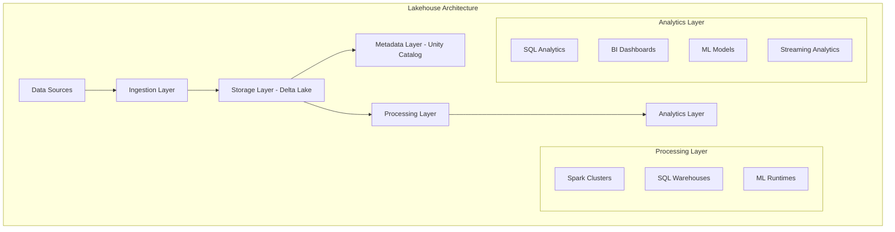

# Module 4: Databricks SQL and Lakehouse Architecture

## Overview

Databricks SQL is a serverless data warehouse built on the Lakehouse platform that provides high-performance analytics, BI dashboards, and SQL queries directly on your data lake. This module covers the fundamental concepts, architecture, and optimization techniques essential for the Databricks Certified Data Engineer Professional exam.

## Key Learning Objectives

- Understand Lakehouse architecture principles and benefits
- Master Databricks SQL warehouse concepts and configuration
- Implement query optimization and performance tuning strategies
- Configure Unity Catalog integration for governance
- Utilize federation capabilities for external data sources
- Apply advanced SQL functions and analytical capabilities
- Implement monitoring and observability best practices

## Table of Contents

1. [Lakehouse Architecture Fundamentals](#1-lakehouse-architecture-fundamentals)
2. [Databricks SQL Warehouses](#2-databricks-sql-warehouses)
3. [Query Optimization and Performance](#3-query-optimization-and-performance)
4. [Unity Catalog Integration](#4-unity-catalog-integration)
5. [Lakehouse Federation](#5-lakehouse-federation)
6. [Advanced SQL Functions](#6-advanced-sql-functions)
7. [Monitoring and Observability](#7-monitoring-and-observability)
8. [Dashboards and Visualization](#8-dashboards-and-visualization)
9. [Security and Governance](#9-security-and-governance)
10. [Best Practices](#10-best-practices)
11. [Practice Questions](#11-practice-questions)
12. [Quick Reference](#12-quick-reference)

## 1. Lakehouse Architecture Fundamentals

### 1.1 What is a Lakehouse?

The Lakehouse combines the best features of data lakes and data warehouses:

- **Data Lake Benefits**: Low-cost storage, support for all data types (structured, semi-structured, unstructured)
- **Data Warehouse Benefits**: ACID transactions, schema enforcement, high-performance queries, BI tool support

### 1.2 Core Lakehouse Components



### 1.3 Lakehouse vs Traditional Architecture

| Aspect | Data Lake | Data Warehouse | Lakehouse |
|--------|-----------|---------------|-----------|
| **Data Types** | All types | Structured only | All types |
| **Storage Cost** | Low | High | Low |
| **ACID Transactions** | No | Yes | Yes |
| **Schema** | Schema-on-read | Schema-on-write | Both |
| **Performance** | Variable | High | High |
| **Governance** | Limited | Strong | Strong |
| **Real-time** | Limited | Limited | Native |

### 1.4 Key Lakehouse Benefits

- **Unified Platform**: Single platform for all analytics workloads
- **Cost Efficiency**: Eliminate data silos and duplication
- **Real-time Analytics**: Streaming and batch processing on same data
- **Data Governance**: Centralized metadata and lineage
- **Open Standards**: Based on open-source technologies

## 2. Databricks SQL Warehouses

### 2.1 SQL Warehouse Architecture

SQL Warehouses are serverless compute resources optimized for SQL workloads:

```python
# Creating SQL warehouse via API
import requests

warehouse_config = {
    "name": "analytics-warehouse",
    "cluster_size": "2X-Small",
    "min_num_clusters": 1,
    "max_num_clusters": 4,
    "auto_stop_mins": 45,
    "enable_photon": True,
    "warehouse_type": "PRO",
    "spot_instance_policy": "COST_OPTIMIZED"
}
```

### 2.2 Warehouse Sizes and Scaling

| Size | DBU/Hour | Use Case |
|------|----------|----------|
| **2X-Small** | 1 | Development, light queries |
| **X-Small** | 2 | Small teams, moderate workloads |
| **Small** | 4 | Medium teams, regular BI |
| **Medium** | 8 | Large teams, heavy analytics |
| **Large** | 16 | Enterprise workloads |
| **X-Large** | 32 | Very large datasets |
| **2X-Large** | 64 | Extreme performance needs |
| **3X-Large** | 128 | Maximum performance |

### 2.3 Auto-scaling Configuration

```sql
-- Configure warehouse scaling
ALTER WAREHOUSE analytics_warehouse SET
  AUTO_STOP_MINS = 30,
  MIN_NUM_CLUSTERS = 1,
  MAX_NUM_CLUSTERS = 5,
  ENABLE_PHOTON = TRUE;
```

### 2.4 Photon Engine

Photon is Databricks' vectorized query engine that provides:
- 2-3x faster query performance
- Reduced costs through efficiency
- Better resource utilization
- Automatic optimization

```sql
-- Enable Photon on warehouse creation
CREATE WAREHOUSE fast_analytics
  WITH (
    CLUSTER_SIZE = 'Medium',
    ENABLE_PHOTON = TRUE,
    WAREHOUSE_TYPE = 'PRO'
  );
```

## 3. Query Optimization and Performance

### 3.1 Query Optimization Techniques

#### 3.1.1 Data Skipping and File Pruning

Databricks automatically uses metadata to skip irrelevant data:

```sql
-- Efficient query with partition pruning
SELECT customer_id, total_amount
FROM sales_data
WHERE date_partition = '2023-12-01'
  AND region = 'US';

-- View data skipping statistics
SELECT * FROM information_schema.table_statistics
WHERE table_name = 'sales_data';
```

#### 3.1.2 Predicate Pushdown

```sql
-- Good: Filters applied early
SELECT customer_name, order_total
FROM (
    SELECT customer_id, customer_name
    FROM customers
    WHERE region = 'North America'
) c
JOIN (
    SELECT customer_id, SUM(amount) as order_total
    FROM orders
    WHERE order_date >= '2023-01-01'
    GROUP BY customer_id
) o ON c.customer_id = o.customer_id;
```

#### 3.1.3 Join Optimization

```sql
-- Broadcast join hint for small tables
SELECT /*+ BROADCAST(dim_table) */ 
    fact.*, dim.description
FROM large_fact_table fact
JOIN small_dimension_table dim 
  ON fact.dim_key = dim.key;

-- Range join optimization
SELECT a.*, b.*
FROM table_a a
JOIN table_b b
  ON a.date_col BETWEEN b.start_date AND b.end_date;
```

### 3.2 Liquid Clustering for SQL Workloads

```sql
-- Create clustered table for optimal SQL performance
CREATE TABLE optimized_sales (
    customer_id BIGINT,
    product_id BIGINT,
    sale_date DATE,
    amount DECIMAL(10,2),
    region STRING
)
USING DELTA
CLUSTER BY (region, sale_date, customer_id);

-- Query performance benefits from clustering
SELECT region, sale_date, SUM(amount) as daily_sales
FROM optimized_sales
WHERE region = 'US' 
  AND sale_date BETWEEN '2023-12-01' AND '2023-12-31'
GROUP BY region, sale_date
ORDER BY sale_date;
```

### 3.3 Materialized Views

```sql
-- Create materialized view for frequent aggregations
CREATE MATERIALIZED VIEW daily_sales_summary AS
SELECT 
    DATE(sale_timestamp) as sale_date,
    region,
    product_category,
    COUNT(*) as transaction_count,
    SUM(amount) as total_sales,
    AVG(amount) as avg_sale_amount
FROM sales_transactions
GROUP BY DATE(sale_timestamp), region, product_category;

-- Refresh materialized view
REFRESH MATERIALIZED VIEW daily_sales_summary;
```

### 3.4 Query Profile Analysis

```sql
-- Enable query profiling
SET spark.sql.execution.arrow.pyspark.enabled = true;
SET spark.sql.adaptive.enabled = true;
SET spark.sql.adaptive.coalescePartitions.enabled = true;

-- Analyze query execution
EXPLAIN COST 
SELECT customer_id, SUM(amount) as total_spent
FROM transactions
WHERE transaction_date >= '2023-01-01'
GROUP BY customer_id
HAVING SUM(amount) > 10000;
```

## 4. Unity Catalog Integration

### 4.1 Three-Level Namespace

Unity Catalog organizes data in a three-level hierarchy:

```
catalog.schema.table
```

```sql
-- Create catalog
CREATE CATALOG sales_data;

-- Create schema
CREATE SCHEMA sales_data.retail;

-- Create table with full path
CREATE TABLE sales_data.retail.transactions (
    transaction_id BIGINT,
    customer_id BIGINT,
    amount DECIMAL(10,2),
    transaction_date DATE
) USING DELTA;

-- Query with full path
SELECT * FROM sales_data.retail.transactions
WHERE transaction_date = CURRENT_DATE();
```

### 4.2 Managed vs External Tables

```sql
-- Managed table (recommended)
CREATE TABLE sales_data.retail.customers_managed (
    customer_id BIGINT NOT NULL,
    name STRING,
    email STRING,
    created_date DATE DEFAULT CURRENT_DATE()
) USING DELTA;

-- External table
CREATE TABLE sales_data.retail.customers_external (
    customer_id BIGINT,
    name STRING,
    email STRING
) USING DELTA
LOCATION 's3://my-bucket/external-data/customers/';
```

### 4.3 Data Lineage and Discovery

```sql
-- View table lineage
SELECT * FROM system.access.table_lineage
WHERE target_table_full_name = 'sales_data.retail.customers';

-- Search data assets
SELECT * FROM system.information_schema.tables
WHERE table_name LIKE '%customer%'
  AND table_catalog = 'sales_data';

-- Add table comments for discoverability
COMMENT ON TABLE sales_data.retail.customers IS 
'Master customer table containing all active and inactive customers';

COMMENT ON COLUMN sales_data.retail.customers.email IS 
'Customer email address - used for marketing communications';
```

## 5. Lakehouse Federation

### 5.1 Supported Federation Sources

Databricks supports federation with:
- PostgreSQL
- MySQL
- SQL Server
- Oracle
- Snowflake
- MongoDB
- Amazon Redshift

### 5.2 Creating Federated Connections

```sql
-- Create connection to PostgreSQL
CREATE CONNECTION postgresql_prod
TYPE postgresql
OPTIONS (
  host 'prod-postgres.company.com',
  port '5432',
  user 'readonly_user'
);

-- Create federated table
CREATE TABLE federated_orders
USING postgresql
OPTIONS (
  path 'public.orders',
  connection 'postgresql_prod'
);
```

### 5.3 Querying Federated Data

```sql
-- Query federated data directly
SELECT 
    order_id,
    customer_id,
    order_total
FROM federated_orders
WHERE order_date >= CURRENT_DATE() - INTERVAL 30 DAYS;

-- Join federated and native data
SELECT 
    c.customer_name,
    f.order_total,
    d.region
FROM customers c
JOIN federated_orders f ON c.customer_id = f.customer_id
JOIN customer_demographics d ON c.customer_id = d.customer_id
WHERE f.order_date >= '2023-12-01';
```

### 5.4 Federation Performance Optimization

```sql
-- Use predicate pushdown for better performance
SELECT *
FROM federated_sales
WHERE sale_date >= '2023-12-01'  -- Pushed to source system
  AND amount > 1000;             -- Evaluated in Databricks

-- Cache frequently accessed federated data
CACHE TABLE cached_federated_customers
SELECT * FROM federated_customers
WHERE active_status = 'Y';
```

## 6. Advanced SQL Functions

### 6.1 Window Functions

```sql
-- Ranking and row numbering
SELECT 
    customer_id,
    order_date,
    amount,
    ROW_NUMBER() OVER (PARTITION BY customer_id ORDER BY order_date) as order_sequence,
    RANK() OVER (PARTITION BY customer_id ORDER BY amount DESC) as amount_rank,
    DENSE_RANK() OVER (ORDER BY amount DESC) as overall_rank
FROM orders;

-- Running calculations
SELECT 
    order_date,
    daily_sales,
    SUM(daily_sales) OVER (ORDER BY order_date ROWS UNBOUNDED PRECEDING) as running_total,
    AVG(daily_sales) OVER (ORDER BY order_date ROWS 6 PRECEDING) as seven_day_avg
FROM daily_sales_summary
ORDER BY order_date;
```

### 6.2 Analytical Functions

```sql
-- Percentiles and distribution
SELECT 
    product_category,
    AVG(price) as avg_price,
    PERCENTILE_CONT(0.5) WITHIN GROUP (ORDER BY price) as median_price,
    PERCENTILE_CONT(0.95) WITHIN GROUP (ORDER BY price) as p95_price,
    STDDEV(price) as price_stddev
FROM products
GROUP BY product_category;

-- Statistical functions
SELECT 
    region,
    CORR(advertising_spend, sales_revenue) as correlation,
    REGR_SLOPE(sales_revenue, advertising_spend) as slope,
    REGR_INTERCEPT(sales_revenue, advertising_spend) as intercept
FROM regional_performance
GROUP BY region;
```

### 6.3 Array and JSON Functions

```sql
-- Array operations
SELECT 
    customer_id,
    purchase_categories,
    ARRAY_SIZE(purchase_categories) as category_count,
    ARRAY_CONTAINS(purchase_categories, 'Electronics') as bought_electronics,
    FILTER(purchase_categories, x -> x != 'Other') as main_categories
FROM customer_preferences;

-- JSON processing
SELECT 
    event_id,
    JSON_EXTRACT_PATH_TEXT(event_data, '$.user.id') as user_id,
    JSON_EXTRACT_PATH_TEXT(event_data, '$.event.type') as event_type,
    JSON_ARRAY_LENGTH(JSON_EXTRACT_PATH(event_data, '$.items')) as item_count
FROM events
WHERE JSON_EXTRACT_PATH_TEXT(event_data, '$.event.type') = 'purchase';
```

### 6.4 Date and Time Functions

```sql
-- Date manipulations
SELECT 
    order_date,
    DATE_TRUNC('month', order_date) as order_month,
    DATE_ADD(order_date, INTERVAL 30 DAY) as due_date,
    DATEDIFF(CURRENT_DATE(), order_date) as days_since_order,
    EXTRACT(QUARTER FROM order_date) as order_quarter,
    DATE_FORMAT(order_date, 'EEEE') as day_of_week
FROM orders;

-- Time zone handling
SELECT 
    event_timestamp,
    CONVERT_TIMEZONE('UTC', 'America/New_York', event_timestamp) as et_time,
    CONVERT_TIMEZONE('UTC', 'Europe/London', event_timestamp) as uk_time
FROM user_events;
```

## 7. Monitoring and Observability

### 7.1 System Tables for Monitoring

```sql
-- Query execution monitoring
SELECT 
    query_id,
    query_text,
    execution_duration,
    total_task_duration,
    rows_produced_count,
    executed_by
FROM system.query.history
WHERE start_time >= CURRENT_TIMESTAMP() - INTERVAL 1 DAY
ORDER BY execution_duration DESC
LIMIT 10;

-- Warehouse utilization
SELECT 
    warehouse_id,
    usage_start_time,
    usage_end_time,
    usage_duration,
    usage_unit,
    billing_origin_product
FROM system.billing.usage
WHERE usage_date >= CURRENT_DATE() - INTERVAL 7 DAYS
  AND billing_origin_product = 'SQL_COMPUTE';
```

### 7.2 Query Profile Analysis

```sql
-- Identify expensive operations
SELECT 
    query_id,
    stage_id,
    node_name,
    duration_ms,
    input_rows,
    output_rows,
    shuffle_read_bytes,
    shuffle_write_bytes
FROM system.query.profile
WHERE query_id = 'your_query_id_here'
ORDER BY duration_ms DESC;
```

### 7.3 Performance Metrics

```sql
-- Track warehouse performance
SELECT 
    warehouse_name,
    AVG(query_duration_ms) as avg_query_time,
    COUNT(*) as query_count,
    SUM(CASE WHEN query_duration_ms > 30000 THEN 1 ELSE 0 END) as slow_queries,
    AVG(queue_duration_ms) as avg_queue_time
FROM system.query.history h
JOIN system.compute.warehouses w ON h.warehouse_id = w.warehouse_id
WHERE start_time >= CURRENT_TIMESTAMP() - INTERVAL 24 HOURS
GROUP BY warehouse_name;
```

## 8. Dashboards and Visualization

### 8.1 SQL Dashboard Creation

```sql
-- Create parameterized queries for dashboards
-- Dashboard parameter: date_range
SELECT 
    DATE_TRUNC('day', order_date) as day,
    SUM(amount) as daily_revenue,
    COUNT(DISTINCT customer_id) as unique_customers,
    AVG(amount) as avg_order_value
FROM orders
WHERE order_date >= CURRENT_DATE() - INTERVAL {{date_range}} DAY
GROUP BY DATE_TRUNC('day', order_date)
ORDER BY day;

-- Dynamic filtering with parameters
-- Parameters: region_filter, min_amount
SELECT 
    product_category,
    SUM(quantity) as total_quantity,
    SUM(revenue) as total_revenue
FROM sales_summary
WHERE region = '{{region_filter}}'
  AND revenue >= {{min_amount}}
GROUP BY product_category
ORDER BY total_revenue DESC;
```

### 8.2 Alert Configuration

```sql
-- Create SQL alert for data quality monitoring
SELECT 
    COUNT(*) as null_customer_ids,
    CURRENT_TIMESTAMP() as check_time
FROM orders
WHERE customer_id IS NULL
  AND order_date = CURRENT_DATE();
-- Alert if null_customer_ids > 0

-- Revenue anomaly detection
SELECT 
    current_revenue,
    avg_revenue,
    (current_revenue - avg_revenue) / avg_revenue * 100 as variance_pct
FROM (
    SELECT 
        SUM(CASE WHEN order_date = CURRENT_DATE() THEN amount ELSE 0 END) as current_revenue,
        AVG(CASE WHEN order_date >= CURRENT_DATE() - INTERVAL 7 DAYS 
                  AND order_date < CURRENT_DATE() THEN amount ELSE NULL END) as avg_revenue
    FROM orders
);
-- Alert if variance_pct < -20 OR variance_pct > 50
```

## 9. Security and Governance

### 9.1 Row-Level Security

```sql
-- Create row filter function
CREATE FUNCTION sales_row_filter(region_access STRING)
RETURNS BOOLEAN
RETURN CASE 
    WHEN current_user() IN ('admin@company.com') THEN TRUE
    WHEN region_access = 'US' AND current_user() LIKE '%@us.company.com' THEN TRUE
    WHEN region_access = 'EU' AND current_user() LIKE '%@eu.company.com' THEN TRUE
    ELSE FALSE
END;

-- Apply row filter to table
ALTER TABLE sales_data.retail.orders
SET ROW FILTER sales_row_filter ON (region);
```

### 9.2 Column-Level Security

```sql
-- Create column mask for PII data
CREATE FUNCTION mask_email(email STRING)
RETURNS STRING
RETURN CASE 
    WHEN is_member('data_analysts') THEN email
    WHEN is_member('customer_service') THEN CONCAT(LEFT(email, 2), '***@***.com')
    ELSE '***@***.com'
END;

-- Apply column mask
ALTER TABLE customers
ALTER COLUMN email SET MASK mask_email;
```

### 9.3 Data Classification

```sql
-- Tag sensitive data
ALTER TABLE customers 
SET TAGS ('data_classification' = 'PII', 'retention_period' = '7_years');

-- Query data classification tags
SELECT 
    table_catalog,
    table_schema, 
    table_name,
    tag_name,
    tag_value
FROM system.information_schema.table_tags
WHERE tag_name = 'data_classification';
```

## 10. Best Practices

### 10.1 SQL Warehouse Optimization

- **Right-size warehouses**: Start small and scale based on usage patterns
- **Use auto-stop**: Configure appropriate auto-stop intervals to control costs
- **Enable Photon**: For analytical workloads requiring high performance
- **Monitor utilization**: Regular review of warehouse metrics and costs

### 10.2 Query Performance

- **Use appropriate data types**: Choose optimal column types for storage and performance
- **Implement liquid clustering**: For frequently queried columns
- **Cache strategic data**: Cache expensive computations and frequently accessed data
- **Optimize join orders**: Let Catalyst optimizer handle most cases, use hints sparingly

### 10.3 Data Organization

```sql
-- Organize data with proper partitioning strategy
CREATE TABLE sales_partitioned (
    transaction_id BIGINT,
    customer_id BIGINT,
    amount DECIMAL(10,2),
    product_category STRING,
    sale_date DATE
) USING DELTA
PARTITIONED BY (DATE_TRUNC('month', sale_date))
CLUSTER BY (customer_id, product_category);
```

### 10.4 Security Best Practices

- **Principle of least privilege**: Grant minimum required permissions
- **Use Unity Catalog**: Centralized governance and security
- **Implement data classification**: Tag and classify sensitive data
- **Regular access reviews**: Periodic review of user permissions

## 11. Practice Questions

### Question 1: Query Optimization
**Q:** A query joining two large tables is performing poorly. The query execution plan shows excessive shuffling. What optimization technique would be most effective?

A. Increase warehouse size  
B. Add more clusters to the warehouse  
C. Implement liquid clustering on join keys  
D. Use CACHE TABLE on both tables  
E. Switch to Delta Live Tables

**Answer: C** - Liquid clustering on join keys will co-locate related data, reducing shuffle operations.

**Explanation:** When large tables are joined, data shuffling occurs to bring related records together. Liquid clustering organizes data physically based on clustering keys, minimizing the shuffle required for joins on those keys.

### Question 2: Lakehouse Federation
**Q:** You need to query data from an external PostgreSQL database alongside Delta Lake tables. What is the most efficient approach for a one-time analytical query?

A. Use COPY INTO to load PostgreSQL data into Delta Lake first  
B. Create a federated table and query directly  
C. Export PostgreSQL data to S3, then query  
D. Use Spark JDBC connector  
E. Set up Delta Sharing

**Answer: B** - Federated tables allow direct querying of external sources without data movement.

**Explanation:** For one-time queries, federation provides the most efficient approach by allowing direct SQL queries against external sources without requiring data movement or additional ETL processes.

### Question 3: Unity Catalog Benefits
**Q:** How does using Unity Catalog managed tables reduce operational overhead compared to external tables?

A. Managed tables automatically compress data  
B. Managed tables don't require VACUUM operations  
C. Databricks handles storage lifecycle and optimization automatically  
D. Managed tables support ACID transactions while external tables don't  
E. Managed tables can only be accessed through Unity Catalog

**Answer: C** - Databricks manages storage lifecycle, optimization, and maintenance for managed tables.

**Explanation:** Managed tables in Unity Catalog delegate storage management to Databricks, including automatic optimization, lifecycle management, and storage efficiency, reducing the operational burden on data teams.

### Question 4: SQL Warehouse Scaling
**Q:** A data team reports that their queries are queuing during peak hours but warehouses sit idle during off-hours. What configuration change would optimize both performance and cost?

A. Increase minimum clusters to handle peak load  
B. Enable auto-scaling with appropriate min/max cluster settings  
C. Use a larger warehouse size  
D. Create dedicated warehouses for each user  
E. Switch to serverless SQL

**Answer: B** - Auto-scaling allows dynamic adjustment to workload demands while controlling costs.

**Explanation:** Auto-scaling automatically adjusts the number of clusters based on query demand, ensuring good performance during peak times while minimizing costs during low-usage periods.

### Question 5: Data Skipping Optimization
**Q:** Which table property would most improve query performance for time-series data frequently filtered by date ranges?

A. ZORDER BY date_column  
B. PARTITIONED BY date_column  
C. CLUSTER BY date_column  
D. Both B and C  
E. All of the above

**Answer: C** - Liquid clustering provides the best performance for modern Delta Lake tables.

**Explanation:** While partitioning (B) and Z-ordering (A) can help, liquid clustering (C) is the recommended approach for new tables as it provides automatic optimization and better performance across various query patterns.

## 12. Quick Reference

### 12.1 Essential SQL Commands

```sql
-- Warehouse Management
CREATE WAREHOUSE analytics_warehouse WITH (CLUSTER_SIZE = 'Medium');
ALTER WAREHOUSE analytics_warehouse SET MAX_NUM_CLUSTERS = 5;
DROP WAREHOUSE old_warehouse;

-- Unity Catalog Operations
CREATE CATALOG production_data;
CREATE SCHEMA production_data.sales;
USE CATALOG production_data;
USE SCHEMA sales;

-- Federation
CREATE CONNECTION postgres_prod TYPE postgresql OPTIONS (...);
CREATE TABLE federated_orders USING postgresql OPTIONS (...);

-- Performance Optimization
OPTIMIZE table_name ZORDER BY (column1, column2);
ANALYZE TABLE table_name COMPUTE STATISTICS;
CACHE TABLE frequently_used_data;

-- Monitoring
SELECT * FROM system.query.history WHERE start_time >= current_date();
DESCRIBE HISTORY table_name;
```

### 12.2 Key Configuration Settings

| Setting | Purpose | Recommended Value |
|---------|---------|------------------|
| `spark.sql.adaptive.enabled` | Enable adaptive query execution | `true` |
| `spark.sql.adaptive.coalescePartitions.enabled` | Optimize partition count | `true` |
| `spark.databricks.optimizer.dynamicFilePruning` | Improve join performance | `true` |
| `spark.databricks.photon.enabled` | Enable Photon acceleration | `true` |

### 12.3 Monitoring Queries

```sql
-- Long-running queries
SELECT query_id, query_text, execution_duration
FROM system.query.history
WHERE execution_duration > 300000  -- 5 minutes
ORDER BY execution_duration DESC;

-- Warehouse utilization
SELECT warehouse_name, SUM(usage_duration) as total_usage
FROM system.billing.usage u
JOIN system.compute.warehouses w ON u.warehouse_id = w.warehouse_id
WHERE usage_date >= current_date() - interval 7 days
GROUP BY warehouse_name;

-- Error analysis
SELECT error_message, COUNT(*) as error_count
FROM system.query.history
WHERE executed_at >= current_date() - interval 1 day
  AND error_message IS NOT NULL
GROUP BY error_message
ORDER BY error_count DESC;
```

## Summary

Databricks SQL and the Lakehouse architecture provide a unified platform for analytics that combines the benefits of data lakes and data warehouses. Key exam topics include:

- **Lakehouse Architecture**: Understanding the unified approach to data storage and processing
- **SQL Warehouses**: Configuration, scaling, and optimization of compute resources
- **Query Optimization**: Techniques for improving performance including clustering, caching, and predicate pushdown
- **Unity Catalog**: Three-level namespace, governance, and security features
- **Federation**: Querying external data sources directly without data movement
- **Advanced SQL**: Window functions, analytical functions, and complex data transformations
- **Monitoring**: System tables, query profiling, and performance analysis
- **Security**: Row-level security, column masking, and data governance

Understanding these concepts and their practical implementation is crucial for the Databricks Data Engineer Professional certification and building effective analytical solutions on the Lakehouse platform.

---

**Next Module:** [MLflow](05_mlflow.md)

**Previous Module:** [Streaming](03_streaming.md)

**Resources:**
- [Databricks SQL Documentation](https://docs.databricks.com/sql/)
- [Unity Catalog Guide](https://docs.databricks.com/unity-catalog/)
- [Lakehouse Architecture Whitepaper](https://databricks.com/glossary/data-lakehouse)
- [SQL Performance Tuning Guide](https://docs.databricks.com/optimizations/)