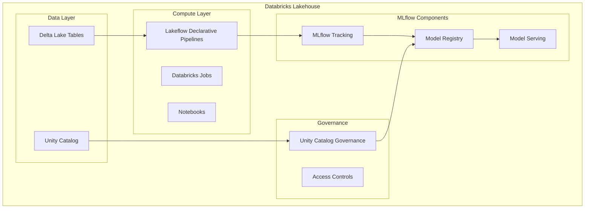

# Module 5: MLflow

## Overview

MLflow is an open-source platform for managing the machine learning lifecycle, including experimentation, reproducibility, deployment, and model management. In the context of Databricks Data Engineering, MLflow serves as a crucial component for integrating machine learning workflows into data pipelines, enabling seamless collaboration between data engineers and data scientists.

## Key Learning Objectives

- Understand MLflow architecture and core components within Databricks
- Master MLflow integration with data engineering pipelines
- Implement model lifecycle management and versioning strategies
- Apply MLOps best practices for production data pipelines
- Integrate MLflow with Unity Catalog for ML governance
- Design scalable ML-enabled data processing workflows
- Monitor and manage models in production environments

## 1. MLflow Architecture and Core Components

### 1.1 MLflow Components Overview

MLflow consists of four main components that work together to manage the ML lifecycle:

| Component | Purpose | Data Engineering Use Cases |
|-----------|---------|---------------------------|
| **MLflow Tracking** | Experiment management and metrics logging | Track data pipeline performance, model accuracy in ETL |
| **MLflow Projects** | Reproducible ML code packaging | Standardize ML pipeline components, CI/CD integration |
| **MLflow Models** | Model packaging and deployment | Deploy models within data pipelines, batch scoring |
| **MLflow Model Registry** | Model versioning and stage management | Manage model lifecycle in production pipelines |

### 1.2 MLflow in Databricks Architecture



### 1.3 Managed MLflow in Databricks

Databricks provides a fully managed MLflow service with enhanced features:

- **Automatic tracking**: Experiments automatically logged to workspace
- **Unity Catalog integration**: Models governed by UC security model
- **Serverless model serving**: Automatic scaling and endpoint management
- **Feature store integration**: Centralized feature management
- **Collaborative experiments**: Shared experiment tracking across teams

## 2. MLflow Tracking for Data Pipelines

### 2.1 Experiment Tracking in Data Processing

```python
import mlflow
import mlflow.spark
from pyspark.sql import SparkSession
from pyspark.sql.functions import *

# Initialize Spark session with MLflow tracking
spark = SparkSession.builder \
    .appName("Data Pipeline with MLflow") \
    .getOrCreate()

# Start MLflow experiment
mlflow.set_experiment("/data-engineering/etl-pipeline-experiments")

with mlflow.start_run(run_name="daily-etl-run") as run:
    # Log pipeline parameters
    mlflow.log_param("source_table", "raw_events")
    mlflow.log_param("target_table", "processed_events")
    mlflow.log_param("processing_date", "2023-12-01")
    
    # Read and process data
    raw_df = spark.table("raw_events")
    
    # Log input metrics
    input_count = raw_df.count()
    mlflow.log_metric("input_record_count", input_count)
    
    # Data processing
    processed_df = raw_df \
        .filter(col("event_time") >= current_date()) \
        .withColumn("processed_timestamp", current_timestamp()) \
        .dropDuplicates(["user_id", "event_time"])
    
    # Log processing metrics
    output_count = processed_df.count()
    duplicate_ratio = (input_count - output_count) / input_count
    
    mlflow.log_metric("output_record_count", output_count)
    mlflow.log_metric("duplicate_ratio", duplicate_ratio)
    mlflow.log_metric("processing_efficiency", output_count / input_count)
    
    # Save processed data
    processed_df.write \
        .format("delta") \
        .mode("overwrite") \
        .saveAsTable("processed_events")
    
    # Log artifacts (data quality report)
    quality_report = processed_df.describe().toPandas()
    quality_report.to_csv("/tmp/quality_report.csv")
    mlflow.log_artifact("/tmp/quality_report.csv", "reports")
```

### 2.2 Model Training Integration

```python
import mlflow
import mlflow.sklearn
from sklearn.ensemble import RandomForestRegressor
from sklearn.metrics import mean_squared_error, r2_score

def train_model_in_pipeline():
    """Train model as part of data pipeline"""
    
    with mlflow.start_run(run_name="model-training-pipeline"):
        # Prepare features from Delta tables
        feature_df = spark.sql("""
            SELECT 
                user_age,
                session_duration,
                page_views,
                purchase_amount as target
            FROM user_behavior_features
            WHERE date >= current_date() - 30
        """).toPandas()
        
        # Split features and target
        X = feature_df.drop('target', axis=1)
        y = feature_df['target']
        
        # Train model
        model = RandomForestRegressor(n_estimators=100, random_state=42)
        model.fit(X, y)
        
        # Calculate metrics
        predictions = model.predict(X)
        mse = mean_squared_error(y, predictions)
        r2 = r2_score(y, predictions)
        
        # Log parameters and metrics
        mlflow.log_param("n_estimators", 100)
        mlflow.log_param("training_data_size", len(X))
        mlflow.log_metric("mse", mse)
        mlflow.log_metric("r2_score", r2)
        
        # Log model
        mlflow.sklearn.log_model(
            model, 
            "model",
            registered_model_name="user_purchase_prediction"
        )
        
        return run.info.run_id
```

### 2.3 Tracking in Lakeflow Declarative Pipelines

```python
# In a DLT pipeline with MLflow integration
import dlt
import mlflow
from pyspark.sql.functions import *

# Configure MLflow for DLT
mlflow.set_tracking_uri("databricks")
mlflow.set_experiment("/data-engineering/dlt-experiments")

@dlt.table(
    comment="Bronze layer with quality tracking"
)
def bronze_events():
    # Start MLflow run for this table
    with mlflow.start_run(run_name="bronze_events_processing", nested=True):
        df = spark.readStream \
            .format("cloudFiles") \
            .option("cloudFiles.format", "json") \
            .load("/mnt/raw-data/events/")
        
        # Log streaming metrics
        mlflow.log_param("source_format", "json")
        mlflow.log_param("processing_mode", "streaming")
        
        return df

@dlt.table(
    comment="Silver layer with data quality expectations"
)
@dlt.expect_or_fail("valid_timestamp", "event_timestamp IS NOT NULL")
@dlt.expect_or_fail("valid_user_id", "user_id IS NOT NULL")
def silver_events():
    with mlflow.start_run(run_name="silver_events_processing", nested=True):
        df = dlt.read("bronze_events") \
            .filter(col("event_timestamp").isNotNull()) \
            .withColumn("processed_date", current_date())
        
        # Log transformation metrics
        mlflow.log_param("quality_checks", "timestamp,user_id")
        
        return df
```

## 3. MLflow Model Registry and Lifecycle Management

### 3.1 Model Registration and Versioning

```python
import mlflow
from mlflow.tracking import MlflowClient

client = MlflowClient()

def register_model_from_run(run_id, model_name):
    """Register model from successful training run"""
    
    # Create registered model if it doesn't exist
    try:
        client.create_registered_model(model_name)
    except Exception:
        pass  # Model already exists
    
    # Create new model version
    model_version = client.create_model_version(
        name=model_name,
        source=f"runs:/{run_id}/model",
        description="Model trained from daily ETL pipeline"
    )
    
    # Add tags for tracking
    client.set_model_version_tag(
        name=model_name,
        version=model_version.version,
        key="training_pipeline",
        value="daily-etl"
    )
    
    return model_version

def promote_model_to_production(model_name, version):
    """Promote model version to production stage"""
    
    # Transition model to Production
    client.transition_model_version_stage(
        name=model_name,
        version=version,
        stage="Production",
        archive_existing_versions=True
    )
    
    # Add production deployment timestamp
    client.set_model_version_tag(
        name=model_name,
        version=version,
        key="production_deployment_date",
        value=str(datetime.now())
    )
```

### 3.2 Model Stage Management

```python
def manage_model_lifecycle():
    """Automated model lifecycle management"""
    
    model_name = "user_purchase_prediction"
    
    # Get latest model version
    latest_version = client.get_latest_versions(
        model_name, 
        stages=["Staging"]
    )[0]
    
    # Validate model performance
    model_uri = f"models:/{model_name}/Staging"
    model = mlflow.sklearn.load_model(model_uri)
    
    # Run validation tests
    validation_df = spark.table("validation_dataset").toPandas()
    X_val = validation_df.drop('target', axis=1)
    y_val = validation_df['target']
    
    predictions = model.predict(X_val)
    current_r2 = r2_score(y_val, predictions)
    
    # Check if model meets production criteria
    if current_r2 > 0.85:  # Production threshold
        promote_model_to_production(model_name, latest_version.version)
        print(f"Model v{latest_version.version} promoted to Production")
    else:
        print(f"Model v{latest_version.version} failed validation (R2: {current_r2})")
```

### 3.3 Unity Catalog Integration

```python
# Register model in Unity Catalog for governance
def register_model_with_unity_catalog():
    """Register model with Unity Catalog for enhanced governance"""
    
    # Set registry URI to Unity Catalog
    mlflow.set_registry_uri("databricks-uc")
    
    with mlflow.start_run() as run:
        # Train and log model
        model = train_model()
        mlflow.sklearn.log_model(
            model,
            "model",
            registered_model_name="my_catalog.my_schema.purchase_prediction_model"
        )
    
    # Model is now governed by Unity Catalog permissions
    # Data engineers can access based on schema permissions
```

## 4. Model Deployment in Data Pipelines

### 4.1 Batch Model Inference

```python
def batch_model_inference():
    """Apply model predictions in batch data pipeline"""
    
    # Load production model
    model_name = "user_purchase_prediction"
    model_uri = f"models:/{model_name}/Production"
    
    # Use MLflow's spark_udf for distributed inference
    predict_udf = mlflow.pyfunc.spark_udf(
        spark, 
        model_uri=model_uri,
        result_type="double"
    )
    
    # Apply predictions to new data
    input_df = spark.table("daily_user_features")
    
    predictions_df = input_df \
        .withColumn(
            "predicted_purchase_amount",
            predict_udf(
                struct(
                    col("user_age"),
                    col("session_duration"), 
                    col("page_views")
                )
            )
        )
    
    # Save predictions
    predictions_df.write \
        .format("delta") \
        .mode("overwrite") \
        .saveAsTable("daily_predictions")
    
    return predictions_df
```

### 4.2 Streaming Model Inference

```python
def streaming_model_inference():
    """Apply model predictions to streaming data"""
    
    # Load model for streaming
    model_uri = "models:/real_time_fraud_detection/Production"
    predict_udf = mlflow.pyfunc.spark_udf(
        spark,
        model_uri=model_uri,
        result_type="double"
    )
    
    # Read streaming data
    streaming_df = spark.readStream \
        .format("kafka") \
        .option("kafka.bootstrap.servers", "localhost:9092") \
        .option("subscribe", "transactions") \
        .load()
    
    # Parse and predict
    parsed_df = streaming_df \
        .select(from_json(col("value").cast("string"), transaction_schema).alias("data")) \
        .select("data.*")
    
    predictions_df = parsed_df \
        .withColumn(
            "fraud_probability",
            predict_udf(
                struct(
                    col("amount"),
                    col("merchant_category"),
                    col("transaction_hour")
                )
            )
        ) \
        .withColumn("is_fraud", col("fraud_probability") > 0.5)
    
    # Write to Delta for real-time monitoring
    query = predictions_df.writeStream \
        .format("delta") \
        .outputMode("append") \
        .option("checkpointLocation", "/tmp/fraud_detection_checkpoint") \
        .table("real_time_fraud_predictions")
    
    return query
```

### 4.3 Model Serving Integration

```python
import requests
import json

def integrate_model_serving_in_pipeline():
    """Integrate Databricks Model Serving in data pipeline"""
    
    # For real-time serving endpoint
    serving_endpoint = "https://your-workspace.databricks.com/serving-endpoints/purchase-prediction/invocations"
    token = dbutils.secrets.get("tokens", "databricks-token")
    
    headers = {
        "Authorization": f"Bearer {token}",
        "Content-Type": "application/json"
    }
    
    def predict_via_serving(features):
        """Call model serving endpoint"""
        payload = {
            "dataframe_records": [features]
        }
        
        response = requests.post(
            serving_endpoint,
            headers=headers,
            data=json.dumps(payload)
        )
        
        return response.json()["predictions"][0]
    
    # Use in data processing
    from pyspark.sql.types import DoubleType
    from pyspark.sql.functions import udf
    
    predict_serving_udf = udf(predict_via_serving, DoubleType())
    
    # Apply to DataFrame (for small-scale real-time processing)
    result_df = input_df.withColumn(
        "prediction",
        predict_serving_udf(
            struct(
                col("feature1"),
                col("feature2"),
                col("feature3")
            )
        )
    )
```

## 5. MLOps Best Practices for Data Engineers

### 5.1 Automated Model Retraining Pipeline

```python
def automated_retraining_pipeline():
    """Automated model retraining as part of data pipeline"""
    
    # Check if retraining is needed
    def should_retrain_model():
        # Get latest model metrics
        latest_run = mlflow.search_runs(
            experiment_ids=["your-experiment-id"],
            order_by=["start_time DESC"],
            max_results=1
        ).iloc[0]
        
        days_since_training = (datetime.now() - latest_run['start_time']).days
        
        # Retrain if model is older than 7 days or performance dropped
        return days_since_training > 7 or latest_run['metrics.r2_score'] < 0.8
    
    if should_retrain_model():
        with mlflow.start_run(run_name="automated-retraining"):
            # Get fresh training data
            training_df = spark.sql("""
                SELECT * FROM feature_store.user_features
                WHERE date >= current_date() - 30
            """).toPandas()
            
            # Train new model
            new_model = train_model(training_df)
            
            # Compare with current production model
            if validate_model_performance(new_model):
                # Register and promote new model
                register_and_promote_model(new_model)
                
                # Update pipeline to use new model
                update_inference_pipeline()
```

### 5.2 Model Monitoring and Drift Detection

```python
def monitor_model_performance():
    """Monitor model performance in production pipeline"""
    
    with mlflow.start_run(run_name="model-monitoring"):
        # Get recent predictions and actuals
        monitoring_df = spark.sql("""
            SELECT 
                prediction,
                actual_value,
                prediction_date
            FROM production_predictions
            WHERE prediction_date >= current_date() - 7
        """).toPandas()
        
        # Calculate performance metrics
        current_mse = mean_squared_error(
            monitoring_df['actual_value'], 
            monitoring_df['prediction']
        )
        
        current_r2 = r2_score(
            monitoring_df['actual_value'], 
            monitoring_df['prediction']
        )
        
        # Log monitoring metrics
        mlflow.log_metric("production_mse", current_mse)
        mlflow.log_metric("production_r2", current_r2)
        mlflow.log_metric("data_drift_score", calculate_data_drift())
        
        # Alert if performance degrades
        if current_r2 < 0.75:  # Alert threshold
            send_alert_to_team(f"Model performance degraded: R2 = {current_r2}")
```

### 5.3 Feature Store Integration

```python
# Feature store integration for consistent feature engineering
from databricks.feature_store import FeatureStoreClient

fs = FeatureStoreClient()

def create_feature_table():
    """Create feature table for ML pipeline"""
    
    # Create feature DataFrame
    feature_df = spark.sql("""
        SELECT 
            user_id,
            avg(session_duration) as avg_session_duration,
            count(*) as total_sessions,
            max(last_login) as last_login_date,
            current_timestamp() as feature_timestamp
        FROM user_sessions
        WHERE date >= current_date() - 30
        GROUP BY user_id
    """)
    
    # Create feature table
    fs.create_table(
        name="feature_store.user_behavior_features",
        primary_keys=["user_id"],
        timestamp_keys=["feature_timestamp"],
        df=feature_df,
        description="User behavior features for ML models"
    )

def train_with_feature_store():
    """Train model using feature store"""
    
    # Create training set
    training_set = fs.create_training_set(
        df=spark.sql("SELECT user_id, purchase_amount FROM training_labels"),
        feature_lookups=[
            FeatureLookup(
                table_name="feature_store.user_behavior_features",
                lookup_key="user_id"
            )
        ],
        label="purchase_amount"
    )
    
    # Load training DataFrame
    training_df = training_set.load_df().toPandas()
    
    # Train model with automatic feature lineage tracking
    with mlflow.start_run():
        model = train_model(training_df)
        
        # Log model with feature store reference
        fs.log_model(
            model=model,
            artifact_path="model",
            flavor=mlflow.sklearn,
            training_set=training_set,
            registered_model_name="feature_store_model"
        )
```

## 6. MLflow in Different Pipeline Patterns

### 6.1 ETL with ML Enhancement

```python
def ml_enhanced_etl_pipeline():
    """ETL pipeline enhanced with ML predictions"""
    
    # Extract
    raw_df = spark.read.format("delta").table("raw_customer_data")
    
    # Transform with feature engineering
    features_df = raw_df \
        .withColumn("customer_tenure_days", 
                   datediff(current_date(), col("signup_date"))) \
        .withColumn("avg_monthly_spend",
                   col("total_spend") / col("customer_tenure_days") * 30)
    
    # ML Enhancement - Predict customer lifetime value
    clv_model_uri = "models:/customer_lifetime_value/Production"
    clv_predict_udf = mlflow.pyfunc.spark_udf(spark, clv_model_uri, "double")
    
    enriched_df = features_df \
        .withColumn(
            "predicted_clv",
            clv_predict_udf(
                struct(
                    col("customer_tenure_days"),
                    col("avg_monthly_spend"),
                    col("product_category_preference")
                )
            )
        ) \
        .withColumn("customer_segment",
                   when(col("predicted_clv") > 1000, "High Value")
                   .when(col("predicted_clv") > 500, "Medium Value")
                   .otherwise("Low Value"))
    
    # Load with ML insights
    enriched_df.write \
        .format("delta") \
        .mode("overwrite") \
        .saveAsTable("customer_segments_with_clv")
```

### 6.2 Change Data Capture with Model Updates

```python
def cdc_with_model_updates():
    """CDC pipeline that triggers model updates on data changes"""
    
    # Enable Change Data Feed on source table
    spark.sql("""
        ALTER TABLE customer_features 
        SET TBLPROPERTIES ('delta.enableChangeDataFeed' = 'true')
    """)
    
    # Read change data
    changes_df = spark.read \
        .format("delta") \
        .option("readChangeData", "true") \
        .option("startingVersion", last_processed_version) \
        .table("customer_features")
    
    # Check if significant changes warrant model retraining
    change_ratio = changes_df.filter(col("_change_type") != "insert").count() / \
                   changes_df.count()
    
    if change_ratio > 0.1:  # 10% of data changed
        with mlflow.start_run(run_name="cdc-triggered-retraining"):
            mlflow.log_param("trigger", "cdc_change_ratio")
            mlflow.log_metric("change_ratio", change_ratio)
            
            # Trigger model retraining
            retrain_model_with_new_data()
```

## 7. Advanced MLflow Patterns

### 7.1 Multi-Model Pipelines

```python
def multi_model_inference_pipeline():
    """Pipeline using multiple models for different tasks"""
    
    # Load multiple models
    fraud_model_uri = "models:/fraud_detection/Production"
    risk_model_uri = "models:/credit_risk/Production" 
    clv_model_uri = "models:/customer_lifetime_value/Production"
    
    # Create UDFs for each model
    fraud_udf = mlflow.pyfunc.spark_udf(spark, fraud_model_uri, "double")
    risk_udf = mlflow.pyfunc.spark_udf(spark, risk_model_uri, "double")
    clv_udf = mlflow.pyfunc.spark_udf(spark, clv_model_uri, "double")
    
    # Apply all models to transaction data
    enriched_transactions = transaction_df \
        .withColumn("fraud_score", 
                   fraud_udf(struct(col("amount"), col("merchant"), col("location")))) \
        .withColumn("risk_score",
                   risk_udf(struct(col("customer_id"), col("amount"), col("payment_method")))) \
        .withColumn("customer_clv",
                   clv_udf(struct(col("customer_id"))))
    
    # Business logic based on multiple model outputs
    final_df = enriched_transactions \
        .withColumn("transaction_status",
                   when(col("fraud_score") > 0.8, "BLOCKED")
                   .when(col("risk_score") > 0.7, "REVIEW")
                   .otherwise("APPROVED")) \
        .withColumn("customer_tier",
                   when(col("customer_clv") > 10000, "PREMIUM")
                   .when(col("customer_clv") > 5000, "GOLD")
                   .otherwise("STANDARD"))
```

### 7.2 A/B Testing Infrastructure

```python
def ab_testing_pipeline():
    """Pipeline for A/B testing different models"""
    
    # Load both model versions
    model_a_uri = "models:/recommendation_engine/1"
    model_b_uri = "models:/recommendation_engine/2"
    
    model_a_udf = mlflow.pyfunc.spark_udf(spark, model_a_uri, "array<string>")
    model_b_udf = mlflow.pyfunc.spark_udf(spark, model_b_uri, "array<string>")
    
    # Split users for A/B test
    test_df = user_df \
        .withColumn("test_group", 
                   when(hash(col("user_id")) % 2 == 0, "A").otherwise("B"))
    
    # Apply appropriate model based on test group
    recommendations_df = test_df \
        .withColumn("recommendations",
                   when(col("test_group") == "A",
                        model_a_udf(struct(col("user_features"))))
                   .otherwise(
                        model_b_udf(struct(col("user_features")))))
    
    # Track experiment metrics
    with mlflow.start_run(run_name="ab-test-tracking"):
        # Log test configuration
        mlflow.log_param("model_a_version", "1")
        mlflow.log_param("model_b_version", "2")
        mlflow.log_param("test_split", "50/50")
        
        # Calculate metrics for each group
        group_a_metrics = calculate_recommendation_metrics(
            recommendations_df.filter(col("test_group") == "A")
        )
        group_b_metrics = calculate_recommendation_metrics(
            recommendations_df.filter(col("test_group") == "B")
        )
        
        mlflow.log_metrics({
            "group_a_ctr": group_a_metrics["ctr"],
            "group_b_ctr": group_b_metrics["ctr"],
            "group_a_precision": group_a_metrics["precision"],
            "group_b_precision": group_b_metrics["precision"]
        })
```

## 8. Monitoring and Alerting

### 8.1 Model Performance Monitoring

```python
def setup_model_monitoring():
    """Set up comprehensive model monitoring"""
    
    # Create monitoring dashboard data
    monitoring_df = spark.sql("""
        WITH model_metrics AS (
            SELECT 
                model_name,
                model_version,
                prediction_date,
                COUNT(*) as prediction_count,
                AVG(prediction_confidence) as avg_confidence,
                AVG(ABS(prediction - actual_value)) as mean_absolute_error
            FROM model_predictions p
            JOIN actual_outcomes a ON p.prediction_id = a.prediction_id
            WHERE prediction_date >= current_date() - 7
            GROUP BY model_name, model_version, prediction_date
        )
        SELECT 
            *,
            LAG(mean_absolute_error) OVER (
                PARTITION BY model_name, model_version 
                ORDER BY prediction_date
            ) as previous_mae,
            (mean_absolute_error - LAG(mean_absolute_error) OVER (
                PARTITION BY model_name, model_version 
                ORDER BY prediction_date
            )) / LAG(mean_absolute_error) OVER (
                PARTITION BY model_name, model_version 
                ORDER BY prediction_date
            ) as mae_change_pct
        FROM model_metrics
    """)
    
    # Save monitoring data
    monitoring_df.write \
        .format("delta") \
        .mode("overwrite") \
        .saveAsTable("ml_monitoring.model_performance_metrics")
```

### 8.2 Data Drift Detection

```python
from scipy import stats
import numpy as np

def detect_data_drift():
    """Detect data drift in model features"""
    
    with mlflow.start_run(run_name="data-drift-detection"):
        # Get training data statistics
        training_stats = spark.sql("""
            SELECT 
                'training' as dataset,
                AVG(feature1) as feature1_mean,
                STDDEV(feature1) as feature1_std,
                AVG(feature2) as feature2_mean,
                STDDEV(feature2) as feature2_std
            FROM training_features
        """).collect()[0]
        
        # Get recent production data statistics  
        production_stats = spark.sql("""
            SELECT 
                'production' as dataset,
                AVG(feature1) as feature1_mean,
                STDDEV(feature1) as feature1_std,
                AVG(feature2) as feature2_mean,
                STDDEV(feature2) as feature2_std
            FROM production_features
            WHERE date >= current_date() - 7
        """).collect()[0]
        
        # Calculate drift metrics
        feature1_drift = abs(training_stats['feature1_mean'] - production_stats['feature1_mean']) / training_stats['feature1_std']
        feature2_drift = abs(training_stats['feature2_mean'] - production_stats['feature2_mean']) / training_stats['feature2_std']
        
        # Log drift metrics
        mlflow.log_metric("feature1_drift_score", feature1_drift)
        mlflow.log_metric("feature2_drift_score", feature2_drift)
        mlflow.log_metric("overall_drift_score", (feature1_drift + feature2_drift) / 2)
        
        # Alert if significant drift detected
        if feature1_drift > 2 or feature2_drift > 2:
            mlflow.log_param("drift_alert", "HIGH")
            send_drift_alert()
```

## 9. Practice Questions

### Question 1: MLflow Tracking
**Q:** A data engineer is building an ETL pipeline that includes a machine learning model for data quality scoring. They want to track the model's performance over time. Which MLflow component should they use, and what metrics are most relevant for a data engineering context?

**A:** Use **MLflow Tracking** to log:
- Data quality metrics (null percentage, duplicate ratio)
- Model performance metrics (accuracy, precision, recall)
- Pipeline metrics (processing time, data volume)
- Infrastructure metrics (memory usage, CPU utilization)

**Explanation:** MLflow Tracking is designed for experiment and performance monitoring. For data engineering, focus on operational metrics alongside model performance.

### Question 2: Model Deployment
**Q:** A data engineer needs to apply a trained model to process 10TB of data daily in a batch pipeline. What's the most efficient way to deploy the model using MLflow?

**A:** Use `mlflow.pyfunc.spark_udf()` to create a distributed UDF that can be applied across Spark partitions.

**Example:**
```python
model_uri = "models:/my_model/Production"
predict_udf = mlflow.pyfunc.spark_udf(spark, model_uri, "double")
df_with_predictions = df.withColumn("prediction", predict_udf(col("features")))
```

**Explanation:** Spark UDF distributes model inference across the cluster, making it efficient for large-scale batch processing.

### Question 3: Model Registry
**Q:** A data engineer needs to ensure that only validated models are used in production pipelines. How should they structure the model promotion workflow?

**A:** Implement a stage-based workflow:
1. **Staging**: Deploy model for validation
2. **Production**: Promote only after validation passes
3. **Archived**: Archive old versions

```python
# Validate in staging
if validate_model_performance(model_uri="models:/my_model/Staging"):
    client.transition_model_version_stage(
        name="my_model",
        version=version,
        stage="Production"
    )
```

### Question 4: Feature Store Integration
**Q:** What are the benefits of using Databricks Feature Store in MLflow-enabled data pipelines?

**A:** Key benefits include:
- **Consistency**: Same features for training and inference
- **Lineage**: Automatic tracking of feature dependencies
- **Reusability**: Share features across teams and models
- **Governance**: Unity Catalog integration for access control
- **Point-in-time lookups**: Consistent feature values for training

### Question 5: Streaming ML
**Q:** A data engineer needs to apply real-time fraud detection to a Kafka stream. How should they integrate MLflow models with streaming pipelines?

**A:** Use MLflow model loading in streaming query:

```python
# Load model once
model_uri = "models:/fraud_detection/Production"
predict_udf = mlflow.pyfunc.spark_udf(spark, model_uri, "double")

# Apply to streaming DataFrame
streaming_df.withColumn("fraud_score", predict_udf(col("features"))) \
    .writeStream \
    .format("delta") \
    .outputMode("append") \
    .start()
```

**Note:** Models are loaded once per executor and reused across micro-batches.

## 10. Key Commands Reference

### MLflow CLI Commands
```bash
# List experiments
mlflow experiments list

# Create experiment
mlflow experiments create --experiment-name "my-experiment"

# Run MLflow UI (for debugging)
mlflow ui --backend-store-uri databricks

# Download artifacts
mlflow artifacts download --artifact-uri runs:/RUN_ID/artifacts --dst-path ./artifacts
```

### Python API Commands
```python
# Experiment management
mlflow.set_experiment("/path/to/experiment")
mlflow.start_run(run_name="my-run")
mlflow.log_param("param_name", value)
mlflow.log_metric("metric_name", value)
mlflow.log_artifact("file_path")

# Model operations
mlflow.sklearn.log_model(model, "model_name")
mlflow.register_model("runs:/RUN_ID/model", "model_name")
model = mlflow.pyfunc.load_model("models:/model_name/Production")

# Model registry
client = MlflowClient()
client.transition_model_version_stage(name, version, stage)
client.get_latest_versions(name, stages)
```

### SQL Commands for Model Registry
```sql
-- Query model registry (Unity Catalog)
SELECT * FROM system.ml.models WHERE name = 'my_model';

-- Query model versions
SELECT * FROM system.ml.model_versions WHERE name = 'my_model';

-- Query experiments
SELECT * FROM system.ml.experiments WHERE name LIKE '%my_experiment%';
```

## 11. Best Practices Summary

### For Data Engineers
1. **Integration Focus**: Use MLflow to enhance data pipelines, not replace them
2. **Scalability**: Leverage Spark UDFs for distributed model inference
3. **Monitoring**: Track both model and pipeline performance metrics
4. **Governance**: Use Unity Catalog for model access control
5. **Automation**: Implement automated retraining based on data drift
6. **Efficiency**: Cache models in executors for streaming workloads

### Model Lifecycle
1. **Development**: Use MLflow Tracking for experiment management
2. **Validation**: Implement automated testing before production promotion
3. **Deployment**: Use Model Registry for version control
4. **Monitoring**: Continuous performance and drift monitoring
5. **Maintenance**: Automated retraining and model updates

### Production Considerations
- Model versioning strategy aligned with data pipeline versions
- Feature engineering consistency between training and inference
- Proper error handling for model failures in pipelines
- Resource optimization for model serving endpoints
- Integration with existing data quality frameworks

## Summary

MLflow serves as a critical component in modern data engineering workflows, enabling seamless integration of machine learning capabilities into data pipelines. For the Databricks Data Engineer Professional certification, key focus areas include:

- **Pipeline Integration**: Embedding ML models into ETL/ELT workflows
- **Scalable Inference**: Using Spark UDFs for distributed model application
- **Lifecycle Management**: Automated model promotion and retirement
- **Monitoring**: Tracking model performance and data drift
- **Governance**: Unity Catalog integration for ML asset management

Understanding these concepts enables data engineers to build robust, ML-enhanced data processing systems that deliver business value while maintaining operational excellence.

---

**Next Module:** [Data Governance and Monitoring](06_governance_monitoring.md)

**Resources:**
- [MLflow Documentation](https://mlflow.org/docs/latest/index.html)
- [Databricks MLflow Guide](https://docs.databricks.com/mlflow/index.html)
- [Feature Store Documentation](https://docs.databricks.com/machine-learning/feature-store/index.html)
- [Model Serving Documentation](https://docs.databricks.com/machine-learning/model-serving/index.html)