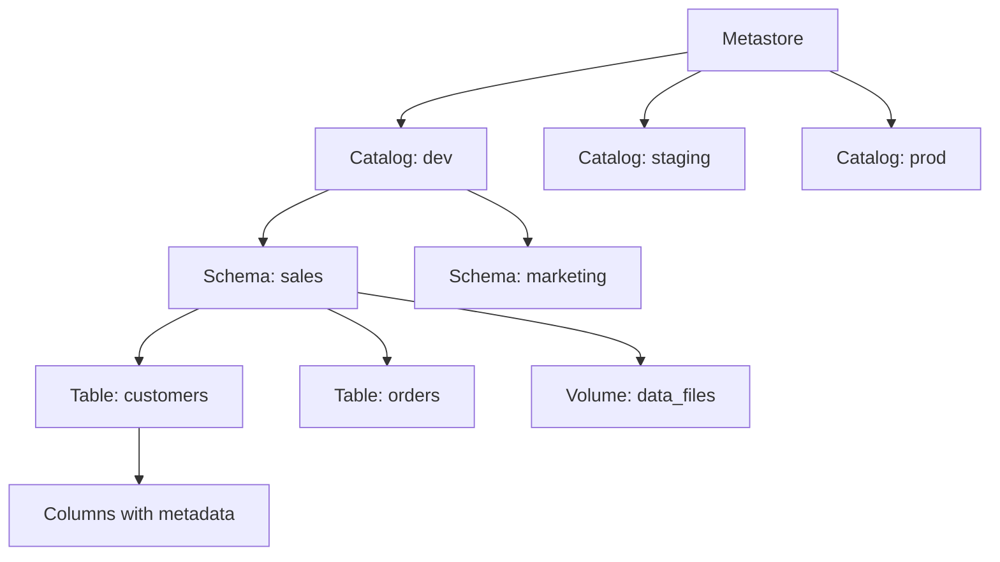

# Module 6: Data Governance and Monitoring

## Overview

Data governance and monitoring are critical components of the Databricks Lakehouse platform, ensuring data quality, security, compliance, and operational excellence. This module covers Unity Catalog for governance, comprehensive monitoring strategies, security implementation, and alerting mechanisms essential for the Databricks Certified Data Engineer Professional exam.

## Key Learning Objectives

- Master Unity Catalog architecture and permission models
- Implement comprehensive data governance strategies
- Configure security controls including ACLs, row/column filters, and data masking
- Monitor data pipelines and workloads using system tables and APIs
- Set up effective alerting mechanisms for data quality and operational issues
- Understand data lineage, audit logging, and compliance requirements
- Apply best practices for scalable governance and monitoring

## Table of Contents
1. [Unity Catalog Architecture](#1-unity-catalog-architecture)
2. [Data Governance and Discovery](#2-data-governance-and-discovery)
3. [Security and Access Controls](#3-security-and-access-controls)
4. [Monitoring and Observability](#4-monitoring-and-observability)
5. [Alerting Mechanisms](#5-alerting-mechanisms)
6. [Data Lineage and Audit Logging](#6-data-lineage-and-audit-logging)
7. [Compliance and Data Privacy](#7-compliance-and-data-privacy)
8. [Performance and Cost Monitoring](#8-performance-and-cost-monitoring)
9. [Code Examples](#9-code-examples)
10. [Practice Questions](#10-practice-questions)
11. [Quick Reference](#11-quick-reference)

## 1. Unity Catalog Architecture

### 1.1 Unity Catalog Overview

Unity Catalog is Databricks' unified governance solution that provides:
- **Centralized metadata management** across all Databricks workspaces
- **Fine-grained access controls** with ANSI SQL standard permissions
- **Data lineage tracking** for complete data lifecycle visibility
- **Audit logging** for compliance and security monitoring
- **Cross-cloud federation** for multi-cloud data strategies

### 1.2 Unity Catalog Hierarchy



### 1.3 Unity Catalog Benefits

**Operational Benefits:**
- **Reduced maintenance burden**: Automatic metadata management
- **Centralized governance**: Single source of truth for all data assets
- **Enhanced security**: Built-in access controls and encryption
- **Cost optimization**: Better resource utilization and monitoring

**Technical Benefits:**
- **Automatic optimization**: Delta Lake optimizations work seamlessly
- **Performance improvements**: Query optimization across all tables
- **Simplified data sharing**: Native Delta Sharing integration
- **Multi-workspace governance**: Consistent policies across environments

### 1.4 Creating and Managing Catalogs

```sql
-- Create a new catalog
CREATE CATALOG IF NOT EXISTS sales_catalog
COMMENT 'Sales data catalog for production analytics';

-- Set catalog owner
ALTER CATALOG sales_catalog OWNER TO `sales_team`;

-- Grant permissions on catalog
GRANT USE CATALOG ON sales_catalog TO `data_analysts`;
GRANT CREATE SCHEMA ON sales_catalog TO `data_engineers`;

-- Create schema within catalog
CREATE SCHEMA IF NOT EXISTS sales_catalog.customer_data
COMMENT 'Customer information and transactions';

-- Use three-level namespace
USE CATALOG sales_catalog;
USE SCHEMA customer_data;

-- Create managed table (recommended)
CREATE TABLE customers (
    customer_id BIGINT,
    email STRING,
    first_name STRING,
    last_name STRING,
    registration_date DATE
) USING DELTA
COMMENT 'Customer master data table';
```

## 2. Data Governance and Discovery

### 2.1 Metadata Management

```sql
-- Add comprehensive metadata to tables
ALTER TABLE sales_catalog.customer_data.customers 
SET TBLPROPERTIES (
    'data_classification' = 'confidential',
    'data_owner' = 'sales_team@company.com',
    'refresh_frequency' = 'daily',
    'data_source' = 'CRM_system',
    'business_purpose' = 'customer analytics and reporting'
);

-- Add column-level metadata
ALTER TABLE sales_catalog.customer_data.customers 
ALTER COLUMN email COMMENT 'Customer email address - PII data';

ALTER TABLE sales_catalog.customer_data.customers 
ALTER COLUMN customer_id COMMENT 'Unique customer identifier';
```

### 2.2 Data Discovery and Search

```python
# Search for tables using metadata
tables_df = spark.sql("""
    SELECT table_catalog, table_schema, table_name, table_type, comment
    FROM system.information_schema.tables 
    WHERE table_catalog = 'sales_catalog'
    AND (comment LIKE '%customer%' OR table_name LIKE '%customer%')
""")

# Search for columns with specific patterns
columns_df = spark.sql("""
    SELECT table_catalog, table_schema, table_name, column_name, data_type, comment
    FROM system.information_schema.columns
    WHERE column_name LIKE '%email%' OR comment LIKE '%PII%'
    ORDER BY table_catalog, table_schema, table_name
""")

# Get table lineage information
lineage_df = spark.sql("""
    SELECT *
    FROM system.access.table_lineage
    WHERE target_table_full_name = 'sales_catalog.customer_data.customers'
""")
```

### 2.3 Tags and Classification

```sql
-- Apply data classification tags
ALTER TABLE sales_catalog.customer_data.customers 
SET TAGS ('classification' = 'confidential', 'domain' = 'sales');

-- Apply column-level tags
ALTER TABLE sales_catalog.customer_data.customers 
ALTER COLUMN email SET TAGS ('pii' = 'true', 'encryption_required' = 'true');

-- Query tables by tags
SELECT table_name, tag_name, tag_value
FROM system.information_schema.table_tags
WHERE tag_name = 'classification' AND tag_value = 'confidential';
```

## 3. Security and Access Controls

### 3.1 Unity Catalog Permission Model

Unity Catalog uses a hierarchical permission inheritance model:

| Level | Inherits From | Grants Access To |
|-------|---------------|------------------|
| **Metastore** | Account Admin | All catalogs, schemas, tables |
| **Catalog** | Metastore | All schemas and tables in catalog |
| **Schema** | Catalog | All tables and volumes in schema |
| **Table/Volume** | Schema | Specific object only |

### 3.2 Access Control Lists (ACLs)

```sql
-- Workspace-level permissions
GRANT CREATE CLUSTER ON WORKSPACE TO `data_engineers`;
GRANT CREATE JOB ON WORKSPACE TO `data_analysts`;

-- Catalog-level permissions
GRANT USE CATALOG ON sales_catalog TO `all_users`;
GRANT CREATE SCHEMA ON sales_catalog TO `data_engineers`;
GRANT MODIFY ON sales_catalog TO `catalog_admins`;

-- Schema-level permissions
GRANT USE SCHEMA ON sales_catalog.customer_data TO `sales_team`;
GRANT CREATE TABLE ON sales_catalog.customer_data TO `data_engineers`;

-- Table-level permissions (most granular)
GRANT SELECT ON sales_catalog.customer_data.customers TO `analysts`;
GRANT MODIFY ON sales_catalog.customer_data.customers TO `senior_engineers`;

-- Column-level permissions (future capability)
-- GRANT SELECT(customer_id, first_name) ON customers TO `junior_analysts`;
```

### 3.3 Row-Level Security (Row Filters)

```sql
-- Create row filter function
CREATE OR REPLACE FUNCTION sales_catalog.customer_data.customer_region_filter(region STRING)
RETURNS BOOLEAN
RETURN 
    CASE 
        WHEN IS_ACCOUNT_GROUP_MEMBER('global_access') THEN TRUE
        WHEN IS_ACCOUNT_GROUP_MEMBER('us_analysts') AND region = 'US' THEN TRUE
        WHEN IS_ACCOUNT_GROUP_MEMBER('eu_analysts') AND region = 'EU' THEN TRUE
        ELSE FALSE
    END;

-- Apply row filter to table
ALTER TABLE sales_catalog.customer_data.customers 
SET ROW FILTER sales_catalog.customer_data.customer_region_filter(region) ON (region);
```

### 3.4 Column-Level Security (Column Masks)

```sql
-- Create masking function for PII data
CREATE OR REPLACE FUNCTION sales_catalog.customer_data.email_mask(email STRING)
RETURNS STRING
RETURN 
    CASE 
        WHEN IS_ACCOUNT_GROUP_MEMBER('pii_access') THEN email
        WHEN IS_ACCOUNT_GROUP_MEMBER('masked_access') THEN 
            CONCAT(LEFT(SPLIT(email, '@')[0], 2), '***@', SPLIT(email, '@')[1])
        ELSE '***REDACTED***'
    END;

-- Apply column mask
ALTER TABLE sales_catalog.customer_data.customers 
ALTER COLUMN email SET MASK sales_catalog.customer_data.email_mask;

-- Hash-based masking for consistent anonymization
CREATE OR REPLACE FUNCTION sales_catalog.customer_data.customer_id_hash(id BIGINT)
RETURNS STRING
RETURN 
    CASE 
        WHEN IS_ACCOUNT_GROUP_MEMBER('full_access') THEN CAST(id AS STRING)
        ELSE SHA2(CAST(id AS STRING), 256)
    END;
```

### 3.5 Data Anonymization and Pseudonymization

```python
from pyspark.sql.functions import *
from pyspark.sql.types import *

# Hashing for pseudonymization
def anonymize_customer_data(df):
    return df.withColumn("customer_id_hash", sha2(col("customer_id").cast("string"), 256)) \
             .withColumn("email_domain", split(col("email"), "@").getItem(1)) \
             .withColumn("age_bucket", 
                        when(col("age") < 25, "18-24")
                        .when(col("age") < 35, "25-34")
                        .when(col("age") < 45, "35-44")
                        .when(col("age") < 55, "45-54")
                        .otherwise("55+")) \
             .drop("customer_id", "email", "age", "first_name", "last_name")

# Tokenization for reversible pseudonymization
def tokenize_sensitive_fields(df, salt="company_secret_salt"):
    return df.withColumn("email_token", 
                        sha2(concat(col("email"), lit(salt)), 256))

# Suppression - remove or null sensitive fields
def suppress_pii_data(df):
    return df.withColumn("email", lit(None).cast("string")) \
             .withColumn("phone", lit(None).cast("string"))

# Generalization - reduce precision
def generalize_location_data(df):
    return df.withColumn("city_generalized", 
                        when(col("population") < 100000, "Small City")
                        .when(col("population") < 1000000, "Medium City")
                        .otherwise("Large City")) \
             .withColumn("zip_prefix", substring(col("zip_code"), 1, 3))
```

## 4. Monitoring and Observability

### 4.1 System Tables for Monitoring

Unity Catalog provides comprehensive system tables for monitoring:

```python
# Query system tables for observability
from pyspark.sql import SparkSession

# Audit logs - track all access and operations
audit_logs = spark.sql("""
    SELECT event_time, user_identity, service_name, action_name, 
           request_params, response, result_state
    FROM system.access.audit
    WHERE event_time > current_timestamp() - INTERVAL 1 DAY
    AND action_name IN ('createTable', 'readTable', 'deleteTable')
    ORDER BY event_time DESC
""")

# Table access patterns
table_access = spark.sql("""
    SELECT table_name, user_name, access_count, last_accessed
    FROM (
        SELECT request_params.full_name_arg as table_name,
               user_identity.email as user_name,
               COUNT(*) as access_count,
               MAX(event_time) as last_accessed
        FROM system.access.audit
        WHERE action_name = 'readTable'
        AND event_time > current_timestamp() - INTERVAL 7 DAYS
        GROUP BY table_name, user_name
    )
    ORDER BY access_count DESC
""")

# Data lineage tracking
lineage_info = spark.sql("""
    SELECT source_table_full_name, target_table_full_name, 
           source_column_name, target_column_name
    FROM system.access.table_lineage
    WHERE target_table_full_name LIKE 'sales_catalog%'
""")
```

### 4.2 Workspace and Cluster Monitoring

```python
# Cluster utilization monitoring
cluster_usage = spark.sql("""
    SELECT cluster_id, cluster_name, driver_node_type, worker_node_type,
           num_workers, start_time, terminated_time,
           runtime_engine, spark_version
    FROM system.compute.clusters
    WHERE start_time > current_timestamp() - INTERVAL 1 DAY
""")

# Job run monitoring
job_runs = spark.sql("""
    SELECT job_id, run_id, run_name, start_time, end_time,
           state, result_state, execution_duration,
           trigger, creator_user_name
    FROM system.workflows.job_runs
    WHERE start_time > current_timestamp() - INTERVAL 1 DAY
    AND result_state IN ('FAILED', 'TIMEOUT', 'CANCELLED')
    ORDER BY start_time DESC
""")

# Pipeline monitoring with DLT event logs
pipeline_events = spark.sql("""
    SELECT timestamp, level, logger, message, 
           pipeline_id, update_id, flow_name
    FROM event_log('pipeline_id_here')
    WHERE level IN ('ERROR', 'WARN')
    AND timestamp > current_timestamp() - INTERVAL 1 HOUR
""")
```

### 4.3 Query Performance Monitoring

```python
# Query history and performance
query_history = spark.sql("""
    SELECT query_id, query_text, start_time, end_time,
           execution_duration, queue_duration, compilation_duration,
           warehouse_id, user_name, state
    FROM system.query.history
    WHERE start_time > current_timestamp() - INTERVAL 1 DAY
    AND execution_duration > 30000  -- Queries taking more than 30 seconds
    ORDER BY execution_duration DESC
""")

# Expensive queries identification
expensive_queries = spark.sql("""
    SELECT query_text, AVG(execution_duration) as avg_duration,
           COUNT(*) as execution_count, user_name
    FROM system.query.history
    WHERE start_time > current_timestamp() - INTERVAL 7 DAYS
    GROUP BY query_text, user_name
    HAVING avg_duration > 60000  -- Average duration > 1 minute
    ORDER BY avg_duration DESC
""")
```

### 4.4 Storage and Cost Monitoring

```python
# Table storage monitoring
storage_metrics = spark.sql("""
    SELECT table_catalog, table_schema, table_name,
           table_size_bytes, num_files, 
           table_size_bytes / (1024*1024*1024) as size_gb
    FROM system.information_schema.table_storage_metrics
    WHERE table_catalog = 'sales_catalog'
    ORDER BY table_size_bytes DESC
""")

# Billable usage tracking
billing_usage = spark.sql("""
    SELECT usage_date, sku_name, warehouse_id, cluster_id,
           usage_quantity, dollar_cost
    FROM system.billing.usage
    WHERE usage_date > current_date() - INTERVAL 30 DAYS
    ORDER BY dollar_cost DESC
""")
```

## 5. Alerting Mechanisms

### 5.1 SQL Alerts for Data Quality

```sql
-- Create alert for data quality issues
CREATE ALERT data_quality_alert
ON SCHEDULE '0 9 * * *'  -- Daily at 9 AM
WAREHOUSE sales_warehouse
AS
SELECT 
    current_timestamp() as check_time,
    COUNT(*) as total_records,
    COUNT(DISTINCT customer_id) as unique_customers,
    SUM(CASE WHEN email IS NULL OR email = '' THEN 1 ELSE 0 END) as missing_emails,
    SUM(CASE WHEN first_name IS NULL OR first_name = '' THEN 1 ELSE 0 END) as missing_names,
    SUM(CASE WHEN registration_date > current_date() THEN 1 ELSE 0 END) as future_dates
FROM sales_catalog.customer_data.customers
HAVING missing_emails > 100 OR missing_names > 50 OR future_dates > 0;

-- Data freshness alert
CREATE ALERT data_freshness_alert
ON SCHEDULE '0 */2 * * *'  -- Every 2 hours
WAREHOUSE sales_warehouse
AS
SELECT 
    table_name,
    last_updated,
    DATEDIFF(hour, last_updated, current_timestamp()) as hours_since_update
FROM (
    SELECT 
        'customers' as table_name,
        MAX(registration_date) as last_updated
    FROM sales_catalog.customer_data.customers
)
HAVING hours_since_update > 25;  -- Alert if data is more than 25 hours old

-- Volume anomaly detection
CREATE ALERT volume_anomaly_alert
ON SCHEDULE '0 8,12,16,20 * * *'  -- Four times daily
WAREHOUSE sales_warehouse
AS
WITH daily_volumes AS (
    SELECT 
        DATE(registration_date) as reg_date,
        COUNT(*) as daily_count
    FROM sales_catalog.customer_data.customers
    WHERE registration_date >= current_date() - INTERVAL 30 DAYS
    GROUP BY DATE(registration_date)
),
volume_stats AS (
    SELECT 
        AVG(daily_count) as avg_volume,
        STDDEV(daily_count) as std_volume
    FROM daily_volumes
    WHERE reg_date < current_date()  -- Exclude today
)
SELECT 
    'Volume Anomaly Detected' as alert_type,
    today.daily_count as today_volume,
    stats.avg_volume,
    stats.std_volume,
    ABS(today.daily_count - stats.avg_volume) / stats.std_volume as z_score
FROM (
    SELECT COUNT(*) as daily_count
    FROM sales_catalog.customer_data.customers
    WHERE DATE(registration_date) = current_date()
) today
CROSS JOIN volume_stats stats
WHERE ABS(today.daily_count - stats.avg_volume) / stats.std_volume > 2;
```

### 5.2 Job and Pipeline Alerts

```python
# Using Databricks REST API for job monitoring
import requests
import json

def monitor_job_runs(job_id, databricks_host, token):
    """Monitor job runs and detect failures"""
    headers = {
        'Authorization': f'Bearer {token}',
        'Content-Type': 'application/json'
    }
    
    # Get recent job runs
    response = requests.get(
        f'{databricks_host}/api/2.1/jobs/runs/list',
        headers=headers,
        params={'job_id': job_id, 'limit': 10}
    )
    
    runs = response.json().get('runs', [])
    
    failed_runs = [
        run for run in runs 
        if run['state']['result_state'] in ['FAILED', 'CANCELLED', 'TIMEOUT']
    ]
    
    if failed_runs:
        # Send alert (implement your notification logic)
        send_failure_alert(job_id, failed_runs)
    
    return failed_runs

def setup_workflow_alerts():
    """Configure workflow alerts using Jobs API"""
    alert_config = {
        "email_notifications": {
            "on_failure": ["data-team@company.com"],
            "on_success": [],
            "on_duration_warning_threshold_exceeded": ["oncall@company.com"]
        },
        "notification_settings": {
            "no_alert_for_skipped_runs": False,
            "no_alert_for_cancelled_runs": False
        }
    }
    return alert_config
```

### 5.3 Custom Monitoring with Delta Live Tables

```python
# DLT pipeline with data quality monitoring
import dlt
from pyspark.sql import functions as F

@dlt.table(
    comment="Customer data with quality checks",
    table_properties={
        "quality": "gold",
        "pipelines.autoOptimize.managed": "true"
    }
)
@dlt.expect_or_drop("valid_email", "email RLIKE '^[a-zA-Z0-9._%+-]+@[a-zA-Z0-9.-]+\\.[a-zA-Z]{2,}$'")
@dlt.expect_or_fail("non_null_customer_id", "customer_id IS NOT NULL")
@dlt.expect("future_date_check", "registration_date <= current_date()")
def clean_customers():
    return (
        dlt.read("raw_customers")
        .withColumn("processed_timestamp", F.current_timestamp())
        .withColumn("data_quality_score", 
                   F.when(F.col("email").isNotNull() & 
                         F.col("first_name").isNotNull() & 
                         F.col("last_name").isNotNull(), 1.0)
                   .otherwise(0.5))
    )

# Monitor DLT pipeline metrics
@dlt.table
def pipeline_metrics():
    return spark.sql("""
        SELECT 
            flow_name,
            COUNT(*) as total_records,
            SUM(CASE WHEN expectations.failed_records > 0 THEN 1 ELSE 0 END) as quality_failures,
            AVG(flow_progress.metrics.num_output_rows) as avg_output_rows
        FROM event_log(current_pipeline_id())
        WHERE event_type = 'flow_progress'
        GROUP BY flow_name
    """)
```

## 6. Data Lineage and Audit Logging

### 6.1 Data Lineage Tracking

```python
# Comprehensive lineage analysis
def analyze_table_lineage(table_name):
    """Analyze complete data lineage for a table"""
    
    # Upstream dependencies
    upstream = spark.sql(f"""
        SELECT DISTINCT source_table_full_name, source_column_name
        FROM system.access.table_lineage
        WHERE target_table_full_name = '{table_name}'
    """)
    
    # Downstream consumers
    downstream = spark.sql(f"""
        SELECT DISTINCT target_table_full_name, target_column_name
        FROM system.access.table_lineage
        WHERE source_table_full_name = '{table_name}'
    """)
    
    # Column-level lineage
    column_lineage = spark.sql(f"""
        SELECT source_table_full_name, source_column_name,
               target_table_full_name, target_column_name,
               created_at, created_by
        FROM system.access.table_lineage
        WHERE target_table_full_name = '{table_name}'
        OR source_table_full_name = '{table_name}'
    """)
    
    return {
        'upstream': upstream.collect(),
        'downstream': downstream.collect(),
        'column_lineage': column_lineage.collect()
    }

# Impact analysis for table changes
def impact_analysis(table_name):
    """Analyze impact of changes to a table"""
    impact_query = f"""
    WITH RECURSIVE lineage_tree AS (
        -- Base case: direct dependencies
        SELECT target_table_full_name as table_name, 1 as level
        FROM system.access.table_lineage
        WHERE source_table_full_name = '{table_name}'
        
        UNION ALL
        
        -- Recursive case: indirect dependencies
        SELECT tl.target_table_full_name, lt.level + 1
        FROM system.access.table_lineage tl
        INNER JOIN lineage_tree lt ON tl.source_table_full_name = lt.table_name
        WHERE lt.level < 5  -- Prevent infinite recursion
    )
    SELECT table_name, MIN(level) as dependency_level, COUNT(*) as path_count
    FROM lineage_tree
    GROUP BY table_name
    ORDER BY dependency_level, table_name
    """
    
    return spark.sql(impact_query)
```

### 6.2 Audit Logging and Compliance

```python
# Comprehensive audit log analysis
def audit_log_analysis(days_back=7):
    """Analyze audit logs for compliance and security"""
    
    # Data access patterns
    data_access = spark.sql(f"""
        SELECT 
            user_identity.email as user_email,
            request_params.full_name_arg as table_accessed,
            COUNT(*) as access_count,
            COUNT(DISTINCT DATE(event_time)) as days_accessed,
            MIN(event_time) as first_access,
            MAX(event_time) as last_access
        FROM system.access.audit
        WHERE action_name = 'readTable'
        AND event_time > current_timestamp() - INTERVAL {days_back} DAYS
        GROUP BY user_email, table_accessed
        HAVING access_count > 100  -- Flag high-volume access
        ORDER BY access_count DESC
    """)
    
    # Failed access attempts
    security_events = spark.sql(f"""
        SELECT 
            event_time,
            user_identity.email as user_email,
            action_name,
            request_params.full_name_arg as resource_accessed,
            response.error_code,
            response.result as error_message
        FROM system.access.audit
        WHERE result_state = 'FAILED'
        AND action_name IN ('readTable', 'createTable', 'deleteTable')
        AND event_time > current_timestamp() - INTERVAL {days_back} DAYS
        ORDER BY event_time DESC
    """)
    
    # Administrative actions
    admin_actions = spark.sql(f"""
        SELECT 
            event_time,
            user_identity.email as admin_user,
            action_name,
            request_params,
            service_name
        FROM system.access.audit
        WHERE action_name IN ('grantPrivileges', 'revokePrivileges', 'createCatalog', 'dropTable')
        AND event_time > current_timestamp() - INTERVAL {days_back} DAYS
        ORDER BY event_time DESC
    """)
    
    return {
        'data_access': data_access,
        'security_events': security_events,
        'admin_actions': admin_actions
    }

# Generate compliance reports
def generate_compliance_report(start_date, end_date):
    """Generate compliance report for audit purposes"""
    
    compliance_summary = spark.sql(f"""
        SELECT 
            'Total Data Access Events' as metric,
            COUNT(*) as count
        FROM system.access.audit
        WHERE action_name = 'readTable'
        AND event_time BETWEEN '{start_date}' AND '{end_date}'
        
        UNION ALL
        
        SELECT 
            'Unique Users Accessing Data' as metric,
            COUNT(DISTINCT user_identity.email) as count
        FROM system.access.audit
        WHERE action_name = 'readTable'
        AND event_time BETWEEN '{start_date}' AND '{end_date}'
        
        UNION ALL
        
        SELECT 
            'Failed Access Attempts' as metric,
            COUNT(*) as count
        FROM system.access.audit
        WHERE result_state = 'FAILED'
        AND event_time BETWEEN '{start_date}' AND '{end_date}'
    """)
    
    return compliance_summary
```

## 7. Compliance and Data Privacy

### 7.1 Data Retention and Purging

```python
# Automated data retention policy implementation
def implement_data_retention_policy():
    """Implement automated data retention policies"""
    
    # Define retention policies
    retention_policies = {
        'customer_transactions': 2555,  # 7 years in days
        'web_analytics': 1095,          # 3 years in days
        'logs': 90,                     # 90 days
        'temp_data': 30                 # 30 days
    }
    
    for table_pattern, retention_days in retention_policies.items():
        # Create deletion job for old data
        deletion_query = f"""
        DELETE FROM sales_catalog.customer_data.{table_pattern}
        WHERE created_date < current_date() - INTERVAL {retention_days} DAYS
        """
        
        # Log retention action
        spark.sql(f"""
        INSERT INTO audit_catalog.governance.retention_log
        VALUES (
            current_timestamp(),
            '{table_pattern}',
            {retention_days},
            'automated_deletion',
            current_user()
        )
        """)

# GDPR compliance - right to be forgotten
def implement_gdpr_deletion(customer_id):
    """Implement GDPR right to be forgotten"""
    
    affected_tables = [
        'sales_catalog.customer_data.customers',
        'sales_catalog.customer_data.transactions', 
        'sales_catalog.analytics.customer_behavior',
        'marketing_catalog.campaigns.email_interactions'
    ]
    
    for table in affected_tables:
        # Soft delete approach - mark as deleted
        spark.sql(f"""
        UPDATE {table}
        SET 
            gdpr_deleted = true,
            deletion_timestamp = current_timestamp(),
            email = 'GDPR_DELETED',
            first_name = 'GDPR_DELETED',
            last_name = 'GDPR_DELETED'
        WHERE customer_id = {customer_id}
        """)
        
    # Log GDPR deletion request
    spark.sql(f"""
    INSERT INTO audit_catalog.compliance.gdpr_deletions
    VALUES (
        {customer_id},
        current_timestamp(),
        current_user(),
        'completed'
    )
    """)

# Data anonymization for analytics
def anonymize_for_analytics(source_table, target_table):
    """Create anonymized dataset for analytics"""
    
    anonymized_df = spark.sql(f"""
    SELECT 
        SHA2(CAST(customer_id AS STRING), 256) as customer_hash,
        CASE 
            WHEN age < 25 THEN '18-24'
            WHEN age < 35 THEN '25-34'
            WHEN age < 45 THEN '35-44'
            WHEN age < 55 THEN '45-54'
            ELSE '55+'
        END as age_bucket,
        state,
        country,
        DATE_TRUNC('month', registration_date) as registration_month,
        CASE 
            WHEN total_purchases < 100 THEN 'low'
            WHEN total_purchases < 1000 THEN 'medium'
            ELSE 'high'
        END as purchase_category
    FROM {source_table}
    """)
    
    anonymized_df.write.mode("overwrite").saveAsTable(target_table)
```

### 7.2 PII Detection and Masking Pipeline

```python
# Automated PII detection and masking
import re
from pyspark.sql.functions import udf, when, col, regexp_replace

# PII detection UDFs
@udf("boolean")
def contains_email(text):
    if text is None:
        return False
    email_pattern = r'\b[A-Za-z0-9._%+-]+@[A-Za-z0-9.-]+\.[A-Z|a-z]{2,}\b'
    return bool(re.search(email_pattern, text))

@udf("boolean") 
def contains_phone(text):
    if text is None:
        return False
    phone_pattern = r'\b\d{3}[-.]?\d{3}[-.]?\d{4}\b'
    return bool(re.search(phone_pattern, text))

@udf("boolean")
def contains_ssn(text):
    if text is None:
        return False
    ssn_pattern = r'\b\d{3}-\d{2}-\d{4}\b'
    return bool(re.search(ssn_pattern, text))

def create_pii_masking_pipeline(input_table, output_table):
    """Create pipeline that detects and masks PII data"""
    
    df = spark.table(input_table)
    
    # Apply masking based on PII detection
    masked_df = df
    
    for column in df.columns:
        if column in ['email', 'email_address']:
            masked_df = masked_df.withColumn(
                column,
                when(contains_email(col(column)), 
                     regexp_replace(col(column), r'(.{2}).*@(.*)\..*', '$1***@$2.***'))
                .otherwise(col(column))
            )
        elif column in ['phone', 'phone_number']:
            masked_df = masked_df.withColumn(
                column,
                when(contains_phone(col(column)),
                     regexp_replace(col(column), r'(\d{3}).*(\d{4})', '$1-***-$2'))
                .otherwise(col(column))
            )
        elif column in ['ssn', 'social_security_number']:
            masked_df = masked_df.withColumn(
                column,
                when(contains_ssn(col(column)), '***-**-****')
                .otherwise(col(column))
            )
    
    # Write to output table
    masked_df.write.mode("overwrite").saveAsTable(output_table)
    
    # Log masking operation
    spark.sql(f"""
    INSERT INTO audit_catalog.governance.masking_log
    VALUES (
        current_timestamp(),
        '{input_table}',
        '{output_table}',
        'pii_masking_completed',
        current_user()
    )
    """)
```

## 8. Performance and Cost Monitoring

### 8.1 Query Performance Analysis

```python
# Advanced query performance monitoring
def analyze_query_performance():
    """Comprehensive query performance analysis"""
    
    # Identify slow queries
    slow_queries = spark.sql("""
    SELECT 
        query_id,
        LEFT(query_text, 100) as query_preview,
        execution_duration / 1000.0 as execution_seconds,
        total_task_duration / 1000.0 as total_task_seconds,
        warehouse_id,
        user_name,
        start_time
    FROM system.query.history
    WHERE start_time > current_timestamp() - INTERVAL 24 HOURS
    AND execution_duration > 60000  -- More than 1 minute
    ORDER BY execution_duration DESC
    LIMIT 20
    """)
    
    # Query resource consumption
    resource_usage = spark.sql("""
    SELECT 
        warehouse_id,
        COUNT(*) as query_count,
        AVG(execution_duration / 1000.0) as avg_execution_seconds,
        AVG(total_task_duration / 1000.0) as avg_task_seconds,
        SUM(read_bytes) / (1024*1024*1024) as total_gb_read,
        SUM(written_bytes) / (1024*1024*1024) as total_gb_written
    FROM system.query.history
    WHERE start_time > current_timestamp() - INTERVAL 7 DAYS
    GROUP BY warehouse_id
    ORDER BY total_gb_read DESC
    """)
    
    return slow_queries, resource_usage

# Warehouse utilization monitoring
def monitor_warehouse_utilization():
    """Monitor warehouse utilization and auto-scaling"""
    
    warehouse_metrics = spark.sql("""
    SELECT 
        warehouse_id,
        cluster_count,
        cluster_size,
        auto_stop_mins,
        state,
        num_running_clusters,
        num_queued_queries
    FROM system.compute.warehouse_events
    WHERE event_time > current_timestamp() - INTERVAL 1 DAY
    ORDER BY event_time DESC
    """)
    
    return warehouse_metrics
```

### 8.2 Cost Optimization Monitoring

```python
# Cost monitoring and optimization
def cost_monitoring_dashboard():
    """Create comprehensive cost monitoring dashboard"""
    
    # Daily cost breakdown
    daily_costs = spark.sql("""
    SELECT 
        usage_date,
        sku_name,
        SUM(usage_quantity) as total_usage,
        SUM(dollar_cost) as total_cost
    FROM system.billing.usage
    WHERE usage_date > current_date() - INTERVAL 30 DAYS
    GROUP BY usage_date, sku_name
    ORDER BY usage_date DESC, total_cost DESC
    """)
    
    # Cost by workspace
    workspace_costs = spark.sql("""
    SELECT 
        workspace_id,
        sku_name,
        SUM(dollar_cost) as total_cost,
        AVG(dollar_cost) as avg_daily_cost
    FROM system.billing.usage
    WHERE usage_date > current_date() - INTERVAL 30 DAYS
    GROUP BY workspace_id, sku_name
    ORDER BY total_cost DESC
    """)
    
    # Idle resource identification
    idle_clusters = spark.sql("""
    SELECT 
        cluster_id,
        cluster_name,
        start_time,
        terminated_time,
        DATEDIFF(terminated_time, start_time) as runtime_hours,
        driver_node_type,
        worker_node_type,
        num_workers
    FROM system.compute.clusters
    WHERE start_time > current_timestamp() - INTERVAL 7 DAYS
    AND terminated_time IS NOT NULL
    AND DATEDIFF(terminated_time, start_time) > 4  -- Running more than 4 hours
    ORDER BY runtime_hours DESC
    """)
    
    return {
        'daily_costs': daily_costs,
        'workspace_costs': workspace_costs,
        'idle_clusters': idle_clusters
    }
```

## 9. Code Examples

### 9.1 Complete Governance Setup

```python
# Complete governance setup example
def setup_governance_framework():
    """Set up complete governance framework"""
    
    # 1. Create governance catalog structure
    spark.sql("""
    CREATE CATALOG IF NOT EXISTS governance_catalog
    COMMENT 'Central governance and compliance catalog'
    """)
    
    spark.sql("""
    CREATE SCHEMA IF NOT EXISTS governance_catalog.audit_logs
    COMMENT 'Audit and compliance tracking'
    """)
    
    spark.sql("""
    CREATE SCHEMA IF NOT EXISTS governance_catalog.data_quality
    COMMENT 'Data quality monitoring and metrics'
    """)
    
    # 2. Create audit tables
    spark.sql("""
    CREATE TABLE IF NOT EXISTS governance_catalog.audit_logs.access_log (
        timestamp TIMESTAMP,
        user_email STRING,
        table_accessed STRING,
        action STRING,
        ip_address STRING,
        success BOOLEAN
    ) USING DELTA
    PARTITIONED BY (DATE(timestamp))
    """)
    
    # 3. Set up data classification
    tables_to_classify = [
        ('sales_catalog.customer_data.customers', 'confidential'),
        ('sales_catalog.transactions.orders', 'internal'),
        ('marketing_catalog.analytics.aggregates', 'public')
    ]
    
    for table, classification in tables_to_classify:
        spark.sql(f"""
        ALTER TABLE {table} 
        SET TBLPROPERTIES ('classification' = '{classification}')
        """)
    
    # 4. Apply security policies
    apply_security_policies()
    
    # 5. Set up monitoring
    setup_monitoring_jobs()

def apply_security_policies():
    """Apply comprehensive security policies"""
    
    # Row-level security for regional data
    spark.sql("""
    CREATE OR REPLACE FUNCTION governance_catalog.security.region_filter(user_region STRING)
    RETURNS BOOLEAN
    RETURN 
        CASE 
            WHEN IS_ACCOUNT_GROUP_MEMBER('global_admin') THEN TRUE
            WHEN IS_ACCOUNT_GROUP_MEMBER('us_team') AND user_region = 'US' THEN TRUE
            WHEN IS_ACCOUNT_GROUP_MEMBER('eu_team') AND user_region = 'EU' THEN TRUE
            ELSE FALSE
        END
    """)
    
    # Column masking for PII
    spark.sql("""
    CREATE OR REPLACE FUNCTION governance_catalog.security.pii_mask(data STRING)
    RETURNS STRING
    RETURN 
        CASE 
            WHEN IS_ACCOUNT_GROUP_MEMBER('pii_authorized') THEN data
            ELSE 'MASKED'
        END
    """)

def setup_monitoring_jobs():
    """Set up automated monitoring jobs"""
    
    # Data quality monitoring
    spark.sql("""
    CREATE OR REPLACE TABLE governance_catalog.data_quality.daily_metrics
    USING DELTA
    AS
    SELECT 
        current_date() as check_date,
        'customers' as table_name,
        COUNT(*) as total_records,
        SUM(CASE WHEN email IS NULL THEN 1 ELSE 0 END) as null_emails,
        SUM(CASE WHEN registration_date > current_date() THEN 1 ELSE 0 END) as invalid_dates
    FROM sales_catalog.customer_data.customers
    """)
```

### 9.2 End-to-End Data Pipeline with Governance

```python
# Complete data pipeline with governance
import dlt
from pyspark.sql import functions as F

# Source with full lineage tracking
@dlt.table(
    comment="Raw customer data from CRM system",
    table_properties={
        "quality": "bronze",
        "source_system": "salesforce_crm",
        "data_classification": "confidential",
        "refresh_frequency": "hourly"
    }
)
def raw_customers():
    return (
        spark.readStream
        .format("cloudFiles")
        .option("cloudFiles.format", "json")
        .option("cloudFiles.schemaLocation", "/mnt/schemas/customers")
        .load("/mnt/raw-data/customers/")
        .withColumn("ingestion_timestamp", F.current_timestamp())
        .withColumn("source_file", F.input_file_name())
    )

# Cleaned data with quality checks
@dlt.table(
    comment="Cleaned customer data with quality validations",
    table_properties={
        "quality": "silver",
        "pipelines.autoOptimize.managed": "true"
    }
)
@dlt.expect_or_drop("valid_email", "email RLIKE '^[^@]+@[^@]+\\.[^@]+$'")
@dlt.expect_or_fail("required_fields", "customer_id IS NOT NULL AND email IS NOT NULL")
@dlt.expect("data_freshness", "ingestion_timestamp > current_timestamp() - INTERVAL 2 HOURS")
def clean_customers():
    return (
        dlt.read_stream("raw_customers")
        .filter(F.col("customer_id").isNotNull())
        .withColumn("email_domain", F.split(F.col("email"), "@").getItem(1))
        .withColumn("processing_timestamp", F.current_timestamp())
        .dropDuplicates(["customer_id"])
    )

# Analytics-ready with privacy protection
@dlt.table(
    comment="Customer analytics with privacy protection",
    table_properties={
        "quality": "gold",
        "data_classification": "internal"
    }
)
def customer_analytics():
    return (
        dlt.read("clean_customers")
        .select(
            F.sha2(F.col("customer_id").cast("string"), 256).alias("customer_hash"),
            F.col("email_domain"),
            F.when(F.col("age") < 25, "18-24")
             .when(F.col("age") < 35, "25-34")
             .when(F.col("age") < 45, "35-44")
             .when(F.col("age") < 55, "45-54")
             .otherwise("55+").alias("age_group"),
            F.col("state"),
            F.col("country"),
            F.date_trunc("month", F.col("registration_date")).alias("registration_month")
        )
    )

# Monitoring and alerting table
@dlt.table(
    comment="Pipeline monitoring metrics"
)
def pipeline_monitoring():
    return spark.sql("""
        SELECT 
            current_timestamp() as metric_timestamp,
            flow_name,
            SUM(metrics.num_output_rows) as output_rows,
            COUNT(*) as batch_count,
            MAX(event_time) as last_update
        FROM event_log(current_pipeline_id())
        WHERE event_type = 'flow_progress'
        AND event_time > current_timestamp() - INTERVAL 1 HOUR
        GROUP BY flow_name
    """)
```

## 10. Practice Questions

### Question 1: Unity Catalog Permissions
A data engineer needs to grant a group of analysts access to read all tables in a specific schema while ensuring they cannot modify any data or create new tables. Which permission should be granted?

**A.** `GRANT ALL PRIVILEGES ON SCHEMA sales_catalog.analytics TO analysts`  
**B.** `GRANT SELECT ON SCHEMA sales_catalog.analytics TO analysts`  
**C.** `GRANT USE SCHEMA ON sales_catalog.analytics TO analysts`  
**D.** `GRANT SELECT ON ALL TABLES IN SCHEMA sales_catalog.analytics TO analysts`  
**E.** `GRANT USAGE ON sales_catalog.analytics TO analysts`  

**Answer: C** - `USE SCHEMA` permission allows reading all tables in the schema without modification rights. Option D would require granting on each table individually.

### Question 2: Row-Level Security
A company needs to implement row-level security where users can only see records from their own region. Which approach should be used?

**A.** Create separate tables for each region  
**B.** Use column masking to hide the region column  
**C.** Create a row filter function that checks user group membership  
**D.** Use RBAC to control table access by region  
**E.** Partition tables by region and control partition access  

**Answer: C** - Row filters are specifically designed for this use case, allowing dynamic filtering based on user context.

### Question 3: System Tables Monitoring
Which system table should be used to monitor failed job runs in the past 24 hours?

**A.** `system.access.audit`  
**B.** `system.compute.clusters`  
**C.** `system.workflows.job_runs`  
**D.** `system.query.history`  
**E.** `system.billing.usage`  

**Answer: C** - `system.workflows.job_runs` contains job execution information including run states and failure details.

### Question 4: Data Quality Alerts
A data engineer wants to create an alert that triggers when more than 5% of records in a daily batch have null email addresses. Which SQL Alert pattern should be used?

**A.** Schedule alert every hour checking for null emails  
**B.** Schedule alert daily after ETL completion with percentage calculation  
**C.** Use event-driven alert triggered by table updates  
**D.** Create streaming alert monitoring real-time data  
**E.** Use job failure notifications for data quality issues  

**Answer: B** - Daily scheduled alerts after ETL completion are most appropriate for batch data quality checks.

### Question 5: Data Lineage
Which system table provides column-level data lineage information?

**A.** `system.access.audit`  
**B.** `system.access.table_lineage`  
**C.** `system.information_schema.tables`  
**D.** `system.information_schema.columns`  
**E.** `system.access.column_lineage`  

**Answer: B** - `system.access.table_lineage` includes both table and column-level lineage information.

### Question 6: GDPR Compliance
What is the most appropriate approach for implementing GDPR "right to be forgotten" in a Delta Lake table?

**A.** Use `DELETE FROM table WHERE customer_id = ?`  
**B.** Use `UPDATE` to set PII fields to null and add deletion timestamp  
**C.** Drop and recreate the table without the customer's data  
**D.** Use `VACUUM` to permanently remove the customer's files  
**E.** Create a new version of the table excluding the customer  

**Answer: B** - Soft deletion with UPDATE allows for audit trails and compliance verification while making data inaccessible.

### Question 7: Column Masking
Which function type is most appropriate for implementing email masking that shows only the domain for unauthorized users?

**A.** Row filter function  
**B.** Column mask function  
**C.** UDF (User Defined Function)  
**D.** Built-in hash function  
**E.** Anonymization view  

**Answer: B** - Column mask functions are specifically designed to transform column values based on user permissions.

### Question 8: Cost Monitoring
Which approach provides the most comprehensive cost monitoring for a Databricks workspace?

**A.** Monitor cluster runtime hours only  
**B.** Use `system.billing.usage` for detailed cost breakdown  
**C.** Track warehouse utilization metrics  
**D.** Monitor storage costs through Delta table metrics  
**E.** Use job execution duration for cost estimation  

**Answer: B** - The system billing table provides the most comprehensive and accurate cost information across all services.

## 11. Quick Reference

### Essential SQL Commands

```sql
-- Unity Catalog Management
CREATE CATALOG catalog_name;
CREATE SCHEMA catalog.schema_name;
GRANT USE CATALOG ON catalog_name TO principal;
GRANT SELECT ON schema_name.table_name TO principal;

-- Security Functions
CREATE FUNCTION row_filter_name(column_name TYPE) RETURNS BOOLEAN;
ALTER TABLE table_name SET ROW FILTER function_name(column);
ALTER TABLE table_name ALTER COLUMN column_name SET MASK function_name;

-- Monitoring Queries
SELECT * FROM system.access.audit WHERE event_time > current_timestamp() - INTERVAL 1 DAY;
SELECT * FROM system.workflows.job_runs WHERE result_state = 'FAILED';
SELECT * FROM system.query.history ORDER BY execution_duration DESC;

-- Data Quality
CREATE ALERT alert_name ON SCHEDULE 'cron_expression' AS query;
DESCRIBE HISTORY table_name;
SELECT * FROM table_changes('table_name', start_version, end_version);

-- Compliance
ALTER TABLE table_name SET TBLPROPERTIES ('classification' = 'confidential');
DELETE FROM table_name WHERE gdpr_delete_flag = true;
```

### Key Python Functions

```python
# System table queries
audit_logs = spark.sql("SELECT * FROM system.access.audit")
job_runs = spark.sql("SELECT * FROM system.workflows.job_runs")
lineage = spark.sql("SELECT * FROM system.access.table_lineage")

# Governance functions
def analyze_table_lineage(table_name): pass
def implement_gdpr_deletion(customer_id): pass
def generate_compliance_report(start_date, end_date): pass

# Monitoring functions  
def monitor_job_runs(job_id, host, token): pass
def cost_monitoring_dashboard(): pass
def analyze_query_performance(): pass
```

### Best Practices Checklist

**Security:**
- [ ] Implement principle of least privilege
- [ ] Use row filters and column masks for sensitive data
- [ ] Regular access review and audit
- [ ] Encrypt data at rest and in transit

**Monitoring:**
- [ ] Set up comprehensive alerting for data quality
- [ ] Monitor system tables for usage patterns
- [ ] Track cost and performance metrics
- [ ] Implement automated anomaly detection

**Governance:**
- [ ] Classify all data assets appropriately
- [ ] Maintain comprehensive metadata
- [ ] Document data lineage
- [ ] Implement retention policies

**Compliance:**
- [ ] Regular compliance audits
- [ ] GDPR/data privacy compliance procedures
- [ ] Secure audit log retention
- [ ] Incident response procedures

## Summary

Data governance and monitoring in Databricks require a comprehensive approach combining Unity Catalog for governance, system tables for monitoring, robust security controls, and proactive alerting. Key exam focus areas include:

- **Unity Catalog**: Architecture, permissions, and benefits
- **Security**: Row filters, column masks, ACLs, and data protection
- **Monitoring**: System tables, query performance, and cost optimization
- **Alerting**: SQL Alerts, job notifications, and data quality monitoring
- **Compliance**: Data lineage, audit logging, and privacy regulations
- **Best Practices**: Comprehensive governance framework implementation

Understanding these concepts and their practical implementation is essential for building secure, compliant, and well-monitored data platforms in Databricks.

---

**Next Module:** [Pipeline Orchestration](07_pipeline_orchestration.md)

**Resources:**
- [Unity Catalog Documentation](https://docs.databricks.com/data-governance/unity-catalog/)
- [System Tables Reference](https://docs.databricks.com/administration-guide/system-tables/)
- [Data Monitoring Guide](https://docs.databricks.com/lakehouse/monitoring.html)