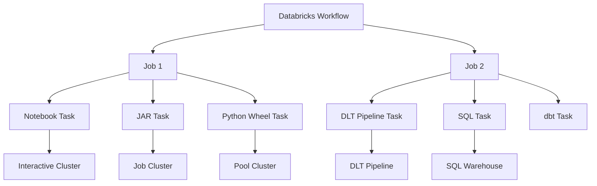
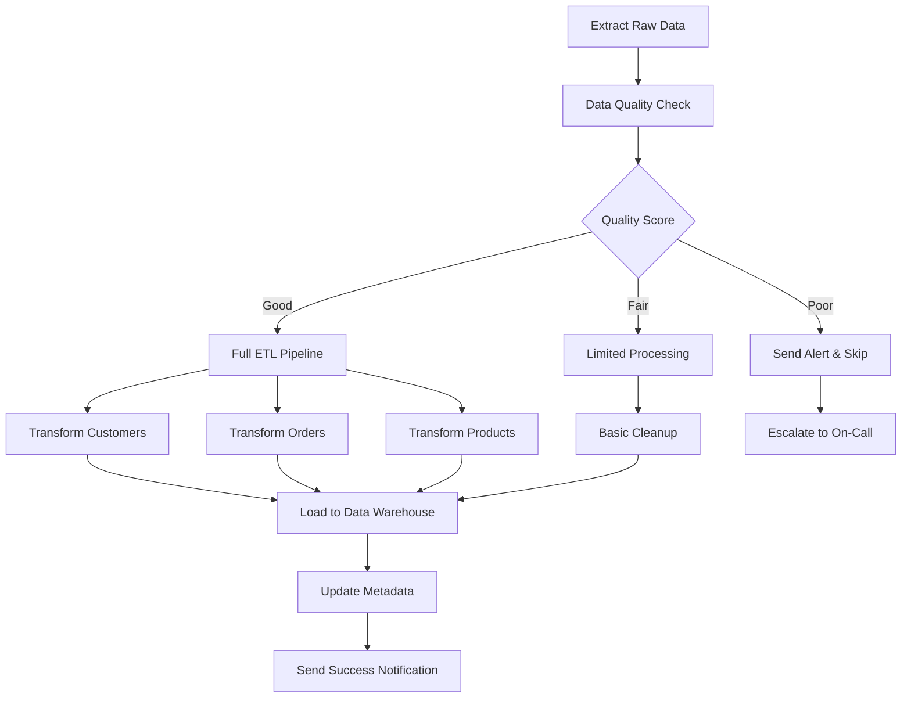

# Module 7: Pipeline Orchestration

## Overview

Pipeline orchestration in Databricks involves designing, building, and managing complex data workflows using Databricks Workflows (Jobs), Databricks Asset Bundles (DABs), and CI/CD integration. This module covers the essential concepts for orchestrating reliable, scalable, and maintainable data pipelines in the Databricks platform.

## Key Learning Objectives

- Understand Databricks Workflows/Jobs architecture and capabilities
- Create and configure jobs using UI, API, and CLI approaches
- Implement task dependencies and control flow patterns
- Design effective error handling and retry strategies
- Set up monitoring, alerting, and observability for pipelines
- Deploy and manage pipelines using Databricks Asset Bundles (DABs)
- Integrate with Git-based CI/CD workflows
- Apply best practices for scalable pipeline orchestration

## Table of Contents

1. [Databricks Workflows Architecture](#1-databricks-workflows-architecture)
2. [Creating and Configuring Jobs](#2-creating-and-configuring-jobs)
3. [Task Dependencies and Control Flow](#3-task-dependencies-and-control-flow)
4. [Error Handling and Retry Strategies](#4-error-handling-and-retry-strategies)
5. [Job Monitoring and Alerting](#5-job-monitoring-and-alerting)
6. [Databricks Asset Bundles (DABs)](#6-databricks-asset-bundles-dabs)
7. [Git Integration and CI/CD](#7-git-integration-and-cicd)
8. [Performance and Best Practices](#8-performance-and-best-practices)
9. [Practice Questions](#9-practice-questions)
10. [Quick Reference](#10-quick-reference)

## 1. Databricks Workflows Architecture

### 1.1 Core Components



### 1.2 Job Types and Tasks

| Task Type | Description | Use Cases | Compute |
|-----------|-------------|-----------|---------|
| **Notebook Task** | Execute Databricks notebooks | Data transformation, analysis, ML training | Clusters |
| **JAR Task** | Run Scala/Java applications | Spark applications, custom processing | Clusters |
| **Python Wheel Task** | Execute Python packages | Modular Python applications | Clusters |
| **SQL Task** | Run SQL queries | Data analysis, reporting | SQL Warehouses |
| **DLT Pipeline Task** | Execute Delta Live Tables pipelines | Streaming and batch ETL | DLT compute |
| **dbt Task** | Run dbt projects | Data transformation | SQL Warehouses |

### 1.3 Cluster Types for Jobs

```python
# Job cluster configuration (recommended for production)
job_cluster_config = {
    "new_cluster": {
        "spark_version": "13.3.x-scala2.12",
        "node_type_id": "i3.xlarge",
        "num_workers": 2,
        "spark_conf": {
            "spark.databricks.cluster.profile": "singleNode"
        },
        "custom_tags": {
            "project": "data_pipeline",
            "environment": "production"
        }
    }
}

# Cluster pool configuration (for faster startup)
pool_cluster_config = {
    "existing_cluster_id": "cluster-pool-123"
}
```

## 2. Creating and Configuring Jobs

### 2.1 Using the Databricks UI

**Step-by-step job creation:**

1. Navigate to **Workflows** in the Databricks workspace
2. Click **Create Job**
3. Configure job settings:
   - **Job name**: Descriptive name following naming conventions
   - **Tasks**: Add and configure individual tasks
   - **Clusters**: Assign appropriate compute resources
   - **Triggers**: Set up scheduling or event-based triggers
   - **Notifications**: Configure success/failure alerts

### 2.2 Using the Jobs API

```python
import requests
import json

# Job configuration using REST API
job_config = {
    "name": "daily_etl_pipeline",
    "tasks": [
        {
            "task_key": "data_ingestion",
            "notebook_task": {
                "notebook_path": "/Repos/production/data-pipelines/ingestion",
                "base_parameters": {
                    "env": "prod",
                    "date": "{{job.trigger.time}}"
                }
            },
            "new_cluster": {
                "spark_version": "13.3.x-scala2.12",
                "node_type_id": "i3.xlarge",
                "num_workers": 2
            },
            "timeout_seconds": 3600,
            "max_retries": 2
        },
        {
            "task_key": "data_transformation",
            "depends_on": [{"task_key": "data_ingestion"}],
            "sql_task": {
                "query": {
                    "query_id": "query-abc123"
                },
                "warehouse_id": "warehouse-xyz789"
            },
            "timeout_seconds": 7200,
            "max_retries": 1
        }
    ],
    "job_clusters": [
        {
            "job_cluster_key": "etl_cluster",
            "new_cluster": {
                "spark_version": "13.3.x-scala2.12",
                "node_type_id": "i3.xlarge",
                "num_workers": 3,
                "autoscale": {
                    "min_workers": 2,
                    "max_workers": 5
                }
            }
        }
    ],
    "schedule": {
        "quartz_cron_expression": "0 0 2 * * ?",
        "timezone_id": "UTC"
    },
    "email_notifications": {
        "on_start": ["data-team@company.com"],
        "on_success": ["data-team@company.com"],
        "on_failure": ["data-team@company.com", "oncall@company.com"]
    },
    "max_concurrent_runs": 1
}

# Create job
headers = {
    "Authorization": f"Bearer {databricks_token}",
    "Content-Type": "application/json"
}

response = requests.post(
    f"{databricks_host}/api/2.1/jobs/create",
    headers=headers,
    data=json.dumps(job_config)
)

job_id = response.json()["job_id"]
print(f"Created job with ID: {job_id}")
```

### 2.3 Using Databricks CLI

```bash
# Install Databricks CLI
pip install databricks-cli

# Configure authentication
databricks configure --token

# Create job from JSON file
databricks jobs create --json-file job_config.json

# Update existing job
databricks jobs reset --job-id 123 --json-file updated_config.json

# List all jobs
databricks jobs list

# Get job details
databricks jobs get --job-id 123

# Run job now
databricks jobs run-now --job-id 123

# Cancel job run
databricks jobs cancel-run --run-id 456
```

### 2.4 Job Configuration Best Practices

```python
# Comprehensive job configuration example
advanced_job_config = {
    "name": "production_etl_pipeline",
    "tags": {
        "team": "data-engineering",
        "project": "customer-analytics",
        "environment": "production"
    },
    "tasks": [
        {
            "task_key": "validate_inputs",
            "notebook_task": {
                "notebook_path": "/Repos/prod/pipelines/validation",
                "base_parameters": {
                    "table_list": "customers,orders,products",
                    "check_mode": "strict"
                }
            },
            "job_cluster_key": "validation_cluster",
            "timeout_seconds": 1800,
            "max_retries": 1,
            "retry_on_timeout": False,
            "min_retry_interval_millis": 30000,
            "max_retry_interval_millis": 300000
        }
    ],
    "job_clusters": [
        {
            "job_cluster_key": "validation_cluster",
            "new_cluster": {
                "cluster_name": "etl-validation-{{job.id}}",
                "spark_version": "13.3.x-scala2.12",
                "node_type_id": "i3.large",
                "num_workers": 1,
                "spark_conf": {
                    "spark.databricks.delta.preview.enabled": "true",
                    "spark.sql.adaptive.enabled": "true",
                    "spark.sql.adaptive.coalescePartitions.enabled": "true"
                },
                "aws_attributes": {
                    "zone_id": "us-west-2a",
                    "instance_profile_arn": "arn:aws:iam::123456789:instance-profile/databricks-role"
                },
                "custom_tags": {
                    "project": "customer-analytics",
                    "cost-center": "data-engineering"
                }
            }
        }
    ],
    "schedule": {
        "quartz_cron_expression": "0 30 1 * * ?",
        "timezone_id": "America/Los_Angeles"
    },
    "max_concurrent_runs": 1,
    "timeout_seconds": 28800  # 8 hours
}
```

## 3. Task Dependencies and Control Flow

### 3.1 Linear Dependencies

```python
# Simple linear pipeline
linear_pipeline = {
    "tasks": [
        {
            "task_key": "extract",
            "notebook_task": {"notebook_path": "/extract"}
        },
        {
            "task_key": "transform",
            "depends_on": [{"task_key": "extract"}],
            "notebook_task": {"notebook_path": "/transform"}
        },
        {
            "task_key": "load",
            "depends_on": [{"task_key": "transform"}],
            "notebook_task": {"notebook_path": "/load"}
        }
    ]
}
```

### 3.2 Parallel and Fan-out Patterns

```python
# Fan-out pattern with parallel processing
fanout_pipeline = {
    "tasks": [
        {
            "task_key": "extract_source_data",
            "notebook_task": {"notebook_path": "/extract"}
        },
        {
            "task_key": "process_customers",
            "depends_on": [{"task_key": "extract_source_data"}],
            "notebook_task": {"notebook_path": "/process_customers"}
        },
        {
            "task_key": "process_orders",
            "depends_on": [{"task_key": "extract_source_data"}],
            "notebook_task": {"notebook_path": "/process_orders"}
        },
        {
            "task_key": "process_products",
            "depends_on": [{"task_key": "extract_source_data"}],
            "notebook_task": {"notebook_path": "/process_products"}
        },
        {
            "task_key": "create_analytics_tables",
            "depends_on": [
                {"task_key": "process_customers"},
                {"task_key": "process_orders"},
                {"task_key": "process_products"}
            ],
            "notebook_task": {"notebook_path": "/analytics"}
        }
    ]
}
```

### 3.3 Conditional Logic with If/Else

```python
# Conditional execution using notebook parameters
def create_conditional_pipeline():
    return {
        "tasks": [
            {
                "task_key": "data_quality_check",
                "notebook_task": {
                    "notebook_path": "/quality_check",
                    "base_parameters": {"return_quality_score": "true"}
                }
            },
            {
                "task_key": "full_processing",
                "depends_on": [{"task_key": "data_quality_check"}],
                "condition_task": {
                    "op": "EQUAL_TO",
                    "left": "{{tasks.data_quality_check.values.quality_score}}",
                    "right": "GOOD"
                },
                "notebook_task": {"notebook_path": "/full_processing"}
            },
            {
                "task_key": "limited_processing",
                "depends_on": [{"task_key": "data_quality_check"}],
                "condition_task": {
                    "op": "EQUAL_TO",
                    "left": "{{tasks.data_quality_check.values.quality_score}}",
                    "right": "FAIR"
                },
                "notebook_task": {"notebook_path": "/limited_processing"}
            },
            {
                "task_key": "send_alert",
                "depends_on": [{"task_key": "data_quality_check"}],
                "condition_task": {
                    "op": "EQUAL_TO",
                    "left": "{{tasks.data_quality_check.values.quality_score}}",
                    "right": "POOR"
                },
                "notebook_task": {"notebook_path": "/send_alert"}
            }
        ]
    }
```

### 3.4 For-Each Loops

```python
# Dynamic task generation with for-each patterns
# Note: This is typically handled programmatically when creating the job

def create_foreach_pipeline(table_list):
    """Create a pipeline that processes each table in parallel"""
    tasks = []
    
    # Create a task for each table
    for table in table_list:
        tasks.append({
            "task_key": f"process_{table}",
            "notebook_task": {
                "notebook_path": "/process_table",
                "base_parameters": {
                    "table_name": table,
                    "processing_date": "{{job.trigger.time}}"
                }
            },
            "job_cluster_key": "processing_cluster"
        })
    
    # Create summary task that depends on all processing tasks
    tasks.append({
        "task_key": "create_summary",
        "depends_on": [{"task_key": f"process_{table}"} for table in table_list],
        "notebook_task": {"notebook_path": "/create_summary"}
    })
    
    return {"tasks": tasks}

# Usage
tables_to_process = ["customers", "orders", "products", "inventory"]
pipeline_config = create_foreach_pipeline(tables_to_process)
```

### 3.5 Complex Workflow Patterns



## 4. Error Handling and Retry Strategies

### 4.1 Retry Configuration

```python
# Task-level retry configuration
task_with_retry = {
    "task_key": "unreliable_task",
    "notebook_task": {"notebook_path": "/unreliable_process"},
    "max_retries": 3,
    "retry_on_timeout": True,
    "min_retry_interval_millis": 30000,   # 30 seconds
    "max_retry_interval_millis": 300000,  # 5 minutes
    "timeout_seconds": 3600  # 1 hour
}

# Exponential backoff retry strategy
task_with_exponential_backoff = {
    "task_key": "api_call_task",
    "notebook_task": {"notebook_path": "/api_integration"},
    "max_retries": 5,
    "retry_on_timeout": True,
    "min_retry_interval_millis": 5000,    # 5 seconds
    "max_retry_interval_millis": 60000,   # 1 minute
    # Actual intervals: 5s, 10s, 20s, 40s, 60s
}
```

### 4.2 Error Handling in Notebooks

```python
# Error handling within notebook tasks
import logging
from pyspark.sql import SparkSession

# Configure logging
logging.basicConfig(level=logging.INFO)
logger = logging.getLogger(__name__)

def robust_data_processing():
    """Example of robust data processing with error handling"""
    try:
        spark = SparkSession.builder.getOrCreate()
        
        # Set job group for easier monitoring
        spark.sparkContext.setJobGroup("data_processing", "Main ETL job")
        
        # Read data with error handling
        try:
            df = spark.read.format("delta").table("bronze.raw_data")
            logger.info(f"Successfully read {df.count()} records")
        except Exception as e:
            logger.error(f"Failed to read source data: {str(e)}")
            # Set task value for downstream conditional logic
            dbutils.jobs.taskValues.set(key="status", value="FAILED")
            dbutils.jobs.taskValues.set(key="error_message", value=str(e))
            raise
        
        # Data validation
        if df.count() == 0:
            logger.warning("No data found in source table")
            dbutils.jobs.taskValues.set(key="status", value="NO_DATA")
            return
        
        # Apply transformations with checkpoints
        try:
            transformed_df = (df
                .filter(col("quality_flag") == "VALID")
                .withColumn("processed_timestamp", current_timestamp())
            )
            
            # Checkpoint for fault tolerance
            transformed_df.cache()
            record_count = transformed_df.count()
            
            if record_count == 0:
                logger.warning("No valid records after filtering")
                dbutils.jobs.taskValues.set(key="status", value="NO_VALID_DATA")
                return
                
        except Exception as e:
            logger.error(f"Transformation failed: {str(e)}")
            dbutils.jobs.taskValues.set(key="status", value="TRANSFORM_FAILED")
            raise
        
        # Write results with error handling
        try:
            (transformed_df
                .write
                .format("delta")
                .mode("overwrite")
                .option("overwriteSchema", "true")
                .saveAsTable("silver.processed_data")
            )
            
            logger.info(f"Successfully processed {record_count} records")
            dbutils.jobs.taskValues.set(key="status", value="SUCCESS")
            dbutils.jobs.taskValues.set(key="record_count", value=str(record_count))
            
        except Exception as e:
            logger.error(f"Write operation failed: {str(e)}")
            dbutils.jobs.taskValues.set(key="status", value="WRITE_FAILED")
            raise
            
    except Exception as e:
        logger.error(f"Job failed with error: {str(e)}")
        
        # Send custom metrics or alerts
        send_failure_notification(str(e))
        
        # Re-raise to fail the task
        raise
    finally:
        # Cleanup resources
        if 'spark' in locals():
            spark.stop()

def send_failure_notification(error_message):
    """Send failure notification to monitoring system"""
    # Implementation depends on your monitoring setup
    pass

# Execute the main function
if __name__ == "__main__":
    robust_data_processing()
```

### 4.3 Circuit Breaker Pattern

```python
# Circuit breaker implementation for external API calls
import time
from enum import Enum
from typing import Callable, Any

class CircuitState(Enum):
    CLOSED = "CLOSED"
    OPEN = "OPEN" 
    HALF_OPEN = "HALF_OPEN"

class CircuitBreaker:
    def __init__(self, failure_threshold: int = 5, timeout: int = 60):
        self.failure_threshold = failure_threshold
        self.timeout = timeout
        self.failure_count = 0
        self.last_failure_time = None
        self.state = CircuitState.CLOSED
    
    def call(self, func: Callable, *args, **kwargs) -> Any:
        if self.state == CircuitState.OPEN:
            if time.time() - self.last_failure_time > self.timeout:
                self.state = CircuitState.HALF_OPEN
            else:
                raise Exception("Circuit breaker is OPEN")
        
        try:
            result = func(*args, **kwargs)
            self.reset()
            return result
        except Exception as e:
            self.record_failure()
            raise e
    
    def record_failure(self):
        self.failure_count += 1
        self.last_failure_time = time.time()
        
        if self.failure_count >= self.failure_threshold:
            self.state = CircuitState.OPEN
    
    def reset(self):
        self.failure_count = 0
        self.state = CircuitState.CLOSED

# Usage in notebook
def call_external_api():
    circuit_breaker = CircuitBreaker(failure_threshold=3, timeout=300)
    
    try:
        result = circuit_breaker.call(make_api_request, "https://api.example.com/data")
        return result
    except Exception as e:
        logger.error(f"API call failed: {str(e)}")
        # Fallback to cached data or alternative processing
        return use_fallback_data()
```

### 4.4 Dead Letter Queue Pattern

```python
# Dead letter queue for failed records
def process_with_dlq(df, target_table, dlq_table):
    """Process data with dead letter queue for failed records"""
    try:
        # Attempt to process all records
        processed_df = df.transform(complex_transformation)
        
        # Write successful records
        (processed_df
            .write
            .format("delta")
            .mode("append")
            .saveAsTable(target_table)
        )
        
    except Exception as e:
        logger.warning(f"Batch processing failed, processing records individually: {str(e)}")
        
        # Process records individually to identify failures
        successful_records = []
        failed_records = []
        
        for row in df.collect():
            try:
                processed_row = transform_single_record(row)
                successful_records.append(processed_row)
            except Exception as record_error:
                failed_record = row.asDict()
                failed_record.update({
                    "error_message": str(record_error),
                    "error_timestamp": current_timestamp(),
                    "processing_job_id": dbutils.widgets.get("job_id")
                })
                failed_records.append(failed_record)
        
        # Write successful records
        if successful_records:
            success_df = spark.createDataFrame(successful_records)
            success_df.write.format("delta").mode("append").saveAsTable(target_table)
        
        # Write failed records to DLQ
        if failed_records:
            dlq_df = spark.createDataFrame(failed_records)
            dlq_df.write.format("delta").mode("append").saveAsTable(dlq_table)
            
            logger.warning(f"Sent {len(failed_records)} records to dead letter queue")
```

## 5. Job Monitoring and Alerting

### 5.1 Job Notifications Configuration

```python
# Comprehensive notification setup
notification_config = {
    "email_notifications": {
        "on_start": ["data-team@company.com"],
        "on_success": ["data-team@company.com"],
        "on_failure": ["data-team@company.com", "on-call@company.com"],
        "no_alert_for_skipped_runs": False
    },
    "webhook_notifications": {
        "on_start": [
            {"id": "slack-webhook-1"}
        ],
        "on_success": [
            {"id": "slack-webhook-1"}
        ],
        "on_failure": [
            {"id": "slack-webhook-1"},
            {"id": "pagerduty-webhook"}
        ]
    }
}
```

### 5.2 Custom Monitoring with System Tables

```sql
-- Query job run history and performance
SELECT 
    job_id,
    job_name,
    run_id,
    run_name,
    state,
    result_state,
    start_time,
    end_time,
    DATEDIFF(SECOND, start_time, end_time) as duration_seconds,
    trigger,
    creator_user_name,
    run_page_url
FROM system.workflow.job_runs
WHERE start_time >= current_timestamp() - INTERVAL 7 DAYS
    AND state IN ('TERMINATED', 'INTERNAL_ERROR')
ORDER BY start_time DESC;

-- Monitor job failure rates
SELECT 
    job_name,
    COUNT(*) as total_runs,
    SUM(CASE WHEN result_state = 'SUCCESS' THEN 1 ELSE 0 END) as successful_runs,
    SUM(CASE WHEN result_state = 'FAILED' THEN 1 ELSE 0 END) as failed_runs,
    SUM(CASE WHEN result_state = 'FAILED' THEN 1 ELSE 0 END) * 100.0 / COUNT(*) as failure_rate
FROM system.workflow.job_runs
WHERE start_time >= current_timestamp() - INTERVAL 30 DAYS
GROUP BY job_name
HAVING failure_rate > 5.0
ORDER BY failure_rate DESC;

-- Identify long-running jobs
SELECT 
    job_name,
    run_id,
    start_time,
    end_time,
    DATEDIFF(SECOND, start_time, end_time) as duration_seconds,
    AVG(DATEDIFF(SECOND, start_time, end_time)) OVER (
        PARTITION BY job_name 
        ORDER BY start_time 
        ROWS BETWEEN 10 PRECEDING AND 1 PRECEDING
    ) as avg_duration_last_10_runs
FROM system.workflow.job_runs
WHERE state = 'TERMINATED' 
    AND result_state = 'SUCCESS'
    AND start_time >= current_timestamp() - INTERVAL 7 DAYS
QUALIFY duration_seconds > avg_duration_last_10_runs * 1.5
ORDER BY duration_seconds DESC;
```

### 5.3 SQL Alerts for Data Quality

```sql
-- Create SQL alert for data freshness
CREATE ALERT data_freshness_alert
ON SCHEDULE '0 */6 * * *'  -- Every 6 hours
AS
SELECT 
    table_name,
    MAX(created_timestamp) as latest_data,
    DATEDIFF(HOUR, MAX(created_timestamp), current_timestamp()) as hours_since_last_data
FROM information_schema.tables t
JOIN my_catalog.bronze.data_summary s ON t.table_name = s.table_name
WHERE t.table_schema = 'bronze'
    AND DATEDIFF(HOUR, MAX(created_timestamp), current_timestamp()) > 8
GROUP BY table_name;

-- Create alert for data volume anomalies  
CREATE ALERT data_volume_alert
ON SCHEDULE '0 9 * * *'  -- Daily at 9 AM
AS
WITH daily_counts AS (
    SELECT 
        DATE(created_timestamp) as date,
        COUNT(*) as record_count
    FROM bronze.transactions
    WHERE created_timestamp >= current_timestamp() - INTERVAL 30 DAYS
    GROUP BY DATE(created_timestamp)
),
stats AS (
    SELECT 
        AVG(record_count) as avg_count,
        STDDEV(record_count) as stddev_count
    FROM daily_counts
    WHERE date < current_date()
)
SELECT 
    dc.date,
    dc.record_count,
    s.avg_count,
    ABS(dc.record_count - s.avg_count) / s.stddev_count as z_score
FROM daily_counts dc
CROSS JOIN stats s
WHERE dc.date = current_date() - 1
    AND ABS(dc.record_count - s.avg_count) / s.stddev_count > 2.0;
```

### 5.4 Custom Metrics and Dashboards

```python
# Custom metrics collection in notebooks
import time
import json

def track_pipeline_metrics():
    """Track custom pipeline metrics"""
    
    # Start timing
    start_time = time.time()
    
    try:
        # Your pipeline logic here
        result_count = process_data()
        
        # Calculate metrics
        duration = time.time() - start_time
        throughput = result_count / duration if duration > 0 else 0
        
        # Log metrics
        metrics = {
            "pipeline_name": "customer_analytics",
            "execution_time": duration,
            "records_processed": result_count,
            "throughput_rps": throughput,
            "status": "SUCCESS",
            "timestamp": time.time()
        }
        
        # Send to monitoring system (examples)
        send_to_datadog(metrics)
        log_to_cloudwatch(metrics)
        store_in_metrics_table(metrics)
        
        # Set task values for job-level monitoring
        dbutils.jobs.taskValues.set("execution_time", str(duration))
        dbutils.jobs.taskValues.set("records_processed", str(result_count))
        
    except Exception as e:
        duration = time.time() - start_time
        error_metrics = {
            "pipeline_name": "customer_analytics", 
            "execution_time": duration,
            "status": "FAILED",
            "error_message": str(e),
            "timestamp": time.time()
        }
        send_to_monitoring_system(error_metrics)
        raise

def store_in_metrics_table(metrics):
    """Store metrics in Delta table for historical analysis"""
    metrics_df = spark.createDataFrame([metrics])
    
    (metrics_df
        .write
        .format("delta")
        .mode("append")
        .option("mergeSchema", "true")
        .saveAsTable("monitoring.pipeline_metrics")
    )
```

## 6. Databricks Asset Bundles (DABs)

### 6.1 DAB Project Structure

```
my-dab-project/
├── databricks.yml              # Main configuration file
├── resources/                  # Resource definitions
│   ├── jobs/
│   │   ├── etl_pipeline.yml
│   │   └── ml_training.yml
│   ├── pipelines/
│   │   └── dlt_pipeline.yml
│   └── experiments/
│       └── ml_experiment.yml
├── src/                        # Source code
│   ├── etl/
│   │   ├── extract.py
│   │   ├── transform.py
│   │   └── load.py
│   └── ml/
│       └── train_model.py
├── tests/                      # Unit tests
│   ├── test_etl.py
│   └── test_ml.py
└── fixtures/                   # Test data and configs
    └── sample_data.json
```

### 6.2 Main Configuration (databricks.yml)

```yaml
bundle:
  name: data-pipeline-bundle
  
variables:
  catalog:
    description: "Target catalog for deployment"
    default: "dev"
  warehouse_id:
    description: "SQL Warehouse ID"

targets:
  dev:
    mode: development
    default: true
    workspace:
      host: https://dev-workspace.cloud.databricks.com
    variables:
      catalog: dev_catalog
      warehouse_id: "abc123"
    
  staging:
    mode: production
    workspace:
      host: https://staging-workspace.cloud.databricks.com
    variables:
      catalog: staging_catalog
      warehouse_id: "def456"
      
  prod:
    mode: production
    workspace:
      host: https://prod-workspace.cloud.databricks.com
    variables:
      catalog: prod_catalog
      warehouse_id: "ghi789"

include:
  - resources/jobs/*.yml
  - resources/pipelines/*.yml

resources:
  jobs:
    etl_pipeline:
      name: "etl-pipeline-${bundle.target}"
      tasks:
        - task_key: extract_data
          notebook_task:
            notebook_path: ${workspace.file_path}/src/etl/extract.py
            base_parameters:
              catalog: ${var.catalog}
              env: ${bundle.target}
          new_cluster:
            spark_version: "13.3.x-scala2.12"
            node_type_id: "i3.xlarge"
            num_workers: 2
            
        - task_key: transform_data
          depends_on:
            - task_key: extract_data
          notebook_task:
            notebook_path: ${workspace.file_path}/src/etl/transform.py
            base_parameters:
              catalog: ${var.catalog}
          existing_cluster_id: ${var.cluster_id}
          
        - task_key: load_data
          depends_on:
            - task_key: transform_data
          sql_task:
            query:
              query_id: ${resources.queries.load_query.id}
            warehouse_id: ${var.warehouse_id}
      
      schedule:
        quartz_cron_expression: "0 0 2 * * ?"
        timezone_id: "UTC"
        
      email_notifications:
        on_failure:
          - data-team@company.com
```

### 6.3 Job Resource Definition

```yaml
# resources/jobs/etl_pipeline.yml
resources:
  jobs:
    daily_etl:
      name: "daily-etl-${bundle.target}"
      tags:
        environment: ${bundle.target}
        team: data-engineering
        
      job_clusters:
        - job_cluster_key: etl_cluster
          new_cluster:
            cluster_name: "etl-cluster-${bundle.target}"
            spark_version: "13.3.x-scala2.12"
            node_type_id: "i3.xlarge"
            autoscale:
              min_workers: 2
              max_workers: 8
            spark_conf:
              spark.databricks.delta.preview.enabled: "true"
              spark.sql.adaptive.enabled: "true"
            custom_tags:
              project: customer-analytics
              cost-center: data-engineering
              
      tasks:
        - task_key: data_validation
          job_cluster_key: etl_cluster
          notebook_task:
            notebook_path: ${workspace.file_path}/src/validation/validate_inputs.py
            base_parameters:
              catalog: ${var.catalog}
              quality_threshold: "0.95"
          timeout_seconds: 1800
          max_retries: 2
          
        - task_key: customer_processing
          depends_on:
            - task_key: data_validation
          job_cluster_key: etl_cluster
          notebook_task:
            notebook_path: ${workspace.file_path}/src/etl/process_customers.py
            base_parameters:
              catalog: ${var.catalog}
              processing_date: "{{job.trigger.time}}"
              
        - task_key: order_processing  
          depends_on:
            - task_key: data_validation
          job_cluster_key: etl_cluster
          notebook_task:
            notebook_path: ${workspace.file_path}/src/etl/process_orders.py
            base_parameters:
              catalog: ${var.catalog}
              
        - task_key: analytics_aggregation
          depends_on:
            - task_key: customer_processing
            - task_key: order_processing
          sql_task:
            query:
              query_id: ${resources.queries.analytics_query.id}
            warehouse_id: ${var.warehouse_id}
            
      schedule:
        quartz_cron_expression: "0 30 2 * * ?"
        timezone_id: "UTC"
        pause_status: UNPAUSED
        
      email_notifications:
        on_start: []
        on_success:
          - data-team@company.com
        on_failure:
          - data-team@company.com
          - on-call@company.com
          
      max_concurrent_runs: 1
      timeout_seconds: 14400  # 4 hours
```

### 6.4 DAB CLI Commands

```bash
# Initialize new DAB project
databricks bundle init

# Validate bundle configuration
databricks bundle validate -t dev

# Deploy to development environment
databricks bundle deploy -t dev

# Deploy to production
databricks bundle deploy -t prod

# Run a specific job
databricks bundle run -t dev etl_pipeline

# Destroy resources (careful!)
databricks bundle destroy -t dev

# Generate deployment files without deploying
databricks bundle generate deploy -t prod

# View deployed resources
databricks bundle summary -t dev
```

### 6.5 Environment-Specific Configurations

```yaml
# Different configurations per environment
targets:
  dev:
    mode: development
    variables:
      catalog: dev_catalog
      cluster_size: small
      schedule_enabled: false
    resources:
      jobs:
        etl_pipeline:
          schedule:
            pause_status: PAUSED  # Don't auto-run in dev
          max_concurrent_runs: 5   # Allow multiple runs for testing
          
  prod:
    mode: production
    variables:
      catalog: prod_catalog
      cluster_size: large
      schedule_enabled: true
    resources:
      jobs:
        etl_pipeline:
          schedule:
            pause_status: UNPAUSED
          max_concurrent_runs: 1
          timeout_seconds: 28800  # 8 hours for production
          job_clusters:
            - job_cluster_key: etl_cluster
              new_cluster:
                autoscale:
                  min_workers: 5
                  max_workers: 20
```

## 7. Git Integration and CI/CD

### 7.1 Git Folders Setup

```python
# Programmatic Git folder configuration
import requests

def setup_git_integration(workspace_url, token, repo_url, branch="main"):
    """Set up Git folders integration"""
    
    headers = {
        "Authorization": f"Bearer {token}",
        "Content-Type": "application/json"
    }
    
    # Create Git folder
    git_folder_config = {
        "url": repo_url,
        "provider": "github",  # or "bitbucket", "gitlab"
        "path": "/Repos/production/data-pipelines",
        "branch": branch
    }
    
    response = requests.post(
        f"{workspace_url}/api/2.0/repos",
        headers=headers,
        json=git_folder_config
    )
    
    if response.status_code == 200:
        print(f"Git folder created successfully: {response.json()}")
    else:
        print(f"Failed to create Git folder: {response.text}")

# Usage
setup_git_integration(
    workspace_url="https://your-workspace.cloud.databricks.com",
    token="your-token",
    repo_url="https://github.com/your-org/data-pipelines",
    branch="main"
)
```

### 7.2 GitHub Actions CI/CD Pipeline

```yaml
# .github/workflows/databricks-deploy.yml
name: Deploy Databricks Resources

on:
  push:
    branches: [main, develop]
  pull_request:
    branches: [main]

env:
  DATABRICKS_HOST: ${{ secrets.DATABRICKS_HOST }}
  DATABRICKS_TOKEN: ${{ secrets.DATABRICKS_TOKEN }}

jobs:
  test:
    runs-on: ubuntu-latest
    
    steps:
    - uses: actions/checkout@v3
    
    - name: Set up Python
      uses: actions/setup-python@v4
      with:
        python-version: '3.9'
        
    - name: Install dependencies
      run: |
        pip install pytest databricks-cli databricks-sdk
        
    - name: Run unit tests
      run: |
        pytest tests/ -v
        
    - name: Validate DAB configuration
      run: |
        databricks bundle validate -t dev

  deploy-dev:
    needs: test
    runs-on: ubuntu-latest
    if: github.ref == 'refs/heads/develop'
    
    steps:
    - uses: actions/checkout@v3
    
    - name: Set up Databricks CLI
      run: |
        pip install databricks-cli
        
    - name: Deploy to Dev
      run: |
        databricks bundle deploy -t dev
        
    - name: Run smoke tests
      run: |
        # Run basic validation job
        databricks jobs run-now --job-id $(databricks jobs list --output json | jq -r '.jobs[] | select(.settings.name=="validation-pipeline-dev") | .job_id')

  deploy-prod:
    needs: test
    runs-on: ubuntu-latest
    if: github.ref == 'refs/heads/main'
    environment: production
    
    steps:
    - uses: actions/checkout@v3
    
    - name: Deploy to Production
      run: |
        pip install databricks-cli
        databricks bundle deploy -t prod
        
    - name: Notify deployment
      uses: 8398a7/action-slack@v3
      with:
        status: ${{ job.status }}
        channel: '#data-engineering'
        webhook_url: ${{ secrets.SLACK_WEBHOOK }}
```

### 7.3 GitLab CI/CD Pipeline

```yaml
# .gitlab-ci.yml
stages:
  - test
  - deploy-dev
  - deploy-staging
  - deploy-prod

variables:
  DATABRICKS_HOST: $DATABRICKS_HOST
  DATABRICKS_TOKEN: $DATABRICKS_TOKEN

test:
  stage: test
  image: python:3.9
  script:
    - pip install pytest databricks-cli
    - pytest tests/ -v
    - databricks bundle validate -t dev
  rules:
    - if: $CI_PIPELINE_SOURCE == "merge_request_event"
    - if: $CI_COMMIT_BRANCH == "main"
    - if: $CI_COMMIT_BRANCH == "develop"

deploy-dev:
  stage: deploy-dev
  image: python:3.9
  script:
    - pip install databricks-cli
    - databricks bundle deploy -t dev
  rules:
    - if: $CI_COMMIT_BRANCH == "develop"
  environment:
    name: development
    url: https://dev-workspace.cloud.databricks.com

deploy-staging:
  stage: deploy-staging
  image: python:3.9
  script:
    - databricks bundle deploy -t staging
  rules:
    - if: $CI_COMMIT_BRANCH == "main"
  when: manual
  environment:
    name: staging
    url: https://staging-workspace.cloud.databricks.com

deploy-prod:
  stage: deploy-prod
  image: python:3.9
  script:
    - databricks bundle deploy -t prod
  rules:
    - if: $CI_COMMIT_BRANCH == "main"
  when: manual
  environment:
    name: production
    url: https://prod-workspace.cloud.databricks.com
  before_script:
    - echo "Deploying to production - double-check configuration"
```

### 7.4 Advanced Git Workflows

```bash
# Feature branch workflow for pipeline development

# Create feature branch
git checkout -b feature/new-data-source

# Develop and test locally using DAB
databricks bundle deploy -t dev

# Test the changes
databricks bundle run -t dev etl_pipeline

# Create pull request
git push origin feature/new-data-source

# After approval, merge to develop
git checkout develop
git merge feature/new-data-source

# Deploy to staging for integration testing
databricks bundle deploy -t staging

# After validation, promote to main
git checkout main
git merge develop

# Deploy to production
databricks bundle deploy -t prod
```

## 8. Performance and Best Practices

### 8.1 Cluster Configuration Optimization

```python
# Optimal cluster configurations for different workloads

# Memory-intensive workloads (large joins, aggregations)
memory_optimized_cluster = {
    "cluster_name": "memory-optimized-cluster",
    "spark_version": "13.3.x-scala2.12", 
    "node_type_id": "r5.4xlarge",  # Memory optimized
    "driver_node_type_id": "r5.2xlarge",
    "num_workers": 4,
    "spark_conf": {
        "spark.sql.adaptive.enabled": "true",
        "spark.sql.adaptive.coalescePartitions.enabled": "true",
        "spark.sql.adaptive.advisoryPartitionSizeInBytes": "256MB",
        "spark.sql.execution.arrow.pyspark.enabled": "true"
    }
}

# Compute-intensive workloads (ML, complex transformations)
compute_optimized_cluster = {
    "cluster_name": "compute-optimized-cluster",
    "spark_version": "13.3.x-scala2.12",
    "node_type_id": "c5.4xlarge",  # Compute optimized
    "driver_node_type_id": "c5.2xlarge", 
    "autoscale": {
        "min_workers": 2,
        "max_workers": 10
    },
    "spark_conf": {
        "spark.sql.adaptive.enabled": "true",
        "spark.sql.adaptive.skewJoin.enabled": "true",
        "spark.databricks.optimizer.dynamicPartitionPruning": "true"
    }
}

# Streaming workloads
streaming_cluster = {
    "cluster_name": "streaming-cluster",
    "spark_version": "13.3.x-scala2.12",
    "node_type_id": "i3.xlarge",
    "num_workers": 3,
    "spark_conf": {
        "spark.streaming.backpressure.enabled": "true",
        "spark.sql.streaming.metricsEnabled": "true",
        "spark.sql.streaming.ui.enabled": "true"
    },
    "custom_tags": {
        "workload-type": "streaming"
    }
}
```

### 8.2 Job Scheduling Best Practices

```python
# Optimal scheduling strategies

# High-frequency pipeline (every 15 minutes)
high_frequency_schedule = {
    "quartz_cron_expression": "0 */15 * * * ?",
    "timezone_id": "UTC",
    "pause_status": "UNPAUSED"
}

# Daily pipeline with optimal timing
daily_schedule = {
    "quartz_cron_expression": "0 30 2 * * ?",  # 2:30 AM UTC - low usage time
    "timezone_id": "UTC"
}

# Weekly pipeline
weekly_schedule = {
    "quartz_cron_expression": "0 0 3 ? * SUN",  # Sunday 3 AM
    "timezone_id": "America/New_York"
}

# Business hours only (weekdays 9-17)
business_hours_schedule = {
    "quartz_cron_expression": "0 0 9-17 ? * MON-FRI",
    "timezone_id": "America/New_York"
}
```

### 8.3 Resource Management

```python
# Dynamic resource allocation based on data volume
def calculate_cluster_size(table_name, base_workers=2, max_workers=20):
    """Calculate optimal cluster size based on data volume"""
    
    # Get table statistics
    df_stats = spark.sql(f"DESCRIBE DETAIL {table_name}")
    size_in_bytes = df_stats.select("sizeInBytes").collect()[0][0]
    
    # Calculate workers needed (rough estimate: 1 worker per 10GB)
    gb_size = size_in_bytes / (1024**3)
    calculated_workers = max(base_workers, min(max_workers, int(gb_size / 10)))
    
    return {
        "autoscale": {
            "min_workers": base_workers,
            "max_workers": calculated_workers
        }
    }

# Dynamic timeout based on historical performance
def calculate_timeout(job_name, default_timeout=3600):
    """Calculate timeout based on historical job performance"""
    
    historical_data = spark.sql(f"""
        SELECT AVG(DATEDIFF(SECOND, start_time, end_time)) as avg_duration
        FROM system.workflow.job_runs
        WHERE job_name = '{job_name}'
            AND result_state = 'SUCCESS'
            AND start_time >= current_timestamp() - INTERVAL 30 DAYS
    """).collect()
    
    if historical_data and historical_data[0][0]:
        avg_duration = historical_data[0][0]
        # Set timeout to 3x average duration with minimum of default
        calculated_timeout = max(default_timeout, int(avg_duration * 3))
        return calculated_timeout
    
    return default_timeout
```

### 8.4 Cost Optimization Strategies

```python
# Cost-optimized job configuration
cost_optimized_job = {
    "name": "cost-optimized-etl",
    "tasks": [
        {
            "task_key": "batch_processing",
            "notebook_task": {"notebook_path": "/etl/batch_process"},
            # Use spot instances for fault-tolerant workloads
            "new_cluster": {
                "spark_version": "13.3.x-scala2.12",
                "node_type_id": "i3.large",
                "num_workers": 3,
                "aws_attributes": {
                    "first_on_demand": 1,  # Keep driver on on-demand
                    "availability": "SPOT_WITH_FALLBACK"
                },
                "autotermination_minutes": 10  # Auto-terminate to save costs
            }
        }
    ],
    # Schedule during low-cost hours
    "schedule": {
        "quartz_cron_expression": "0 0 2 * * ?",  # 2 AM when costs are lower
        "timezone_id": "UTC"
    }
}

# Pool-based configuration for faster startup and cost savings
pool_config = {
    "instance_pool_id": "pool-abc123",
    "min_idle_instances": 0,
    "max_capacity": 10,
    "idle_instance_autotermination_minutes": 10
}
```

### 8.5 Data Optimization for Pipelines

```python
# Optimize data layout for pipeline performance
def optimize_pipeline_tables():
    """Optimize tables used in pipelines"""
    
    # Enable auto-optimize for frequently written tables
    spark.sql("""
        ALTER TABLE bronze.transactions SET TBLPROPERTIES (
            'delta.autoOptimize.optimizeWrite' = 'true',
            'delta.autoOptimize.autoCompact' = 'true'
        )
    """)
    
    # Liquid clustering for analytical queries
    spark.sql("""
        ALTER TABLE silver.customer_analytics 
        CLUSTER BY (customer_segment, date_partition)
    """)
    
    # Partition frequently accessed tables
    spark.sql("""
        CREATE TABLE IF NOT EXISTS gold.daily_reports (
            report_date DATE,
            metric_name STRING,
            metric_value DOUBLE,
            created_timestamp TIMESTAMP
        ) USING DELTA
        PARTITIONED BY (report_date)
        CLUSTER BY (metric_name)
    """)

# Pipeline-aware caching strategy
def setup_pipeline_caching():
    """Set up caching for multi-stage pipelines"""
    
    # Cache intermediate results that are used multiple times
    customer_base = spark.table("silver.customers").cache()
    
    # Process multiple outputs from cached data
    customer_metrics = customer_base.groupBy("segment").agg(
        count("*").alias("customer_count"),
        avg("lifetime_value").alias("avg_ltv")
    )
    
    customer_rankings = customer_base.withColumn(
        "rank", 
        row_number().over(Window.partitionBy("segment").orderBy(desc("lifetime_value")))
    )
    
    # Persist results and unpersist cache
    customer_metrics.write.mode("overwrite").saveAsTable("gold.customer_metrics")
    customer_rankings.write.mode("overwrite").saveAsTable("gold.customer_rankings")
    
    customer_base.unpersist()
```

## 9. Practice Questions

### Question 1: Job Configuration
**Q:** A data engineer needs to create a production job that processes customer data daily. The job should retry failed tasks up to 3 times with exponential backoff, timeout after 2 hours, and notify the team on failures. Which configuration is optimal?

**A.**
```python
{
    "max_retries": 3,
    "retry_on_timeout": True,
    "min_retry_interval_millis": 30000,
    "max_retry_interval_millis": 300000,
    "timeout_seconds": 7200,
    "email_notifications": {
        "on_failure": ["data-team@company.com"]
    }
}
```

**Explanation:** This configuration provides exponential backoff (30s to 5min), 2-hour timeout (7200 seconds), and appropriate notifications.

### Question 2: Task Dependencies
**Q:** In a workflow with tasks A, B, C, and D, where B and C depend on A, and D depends on both B and C, how should the dependencies be configured?

**A.**
```python
{
    "tasks": [
        {"task_key": "A"},
        {"task_key": "B", "depends_on": [{"task_key": "A"}]},
        {"task_key": "C", "depends_on": [{"task_key": "A"}]},
        {"task_key": "D", "depends_on": [{"task_key": "B"}, {"task_key": "C"}]}
    ]
}
```

**Explanation:** Task D must explicitly depend on both B and C to ensure it waits for both to complete.

### Question 3: Error Handling
**Q:** What's the best approach to handle a scenario where some records in a batch might fail processing, but you want to continue processing valid records?

**A.** Implement a dead letter queue pattern that processes records individually on batch failure and stores failed records separately.

**Explanation:** This approach maximizes data processing while capturing failures for later analysis and reprocessing.

### Question 4: Databricks Asset Bundles
**Q:** A team wants to deploy the same pipeline to dev, staging, and prod environments with different configurations. What DAB feature should they use?

**A.** Use the `targets` configuration in `databricks.yml` with environment-specific variables and settings.

**Explanation:** Targets allow environment-specific configuration while maintaining the same codebase across environments.

### Question 5: Git Integration
**Q:** How should a team implement CI/CD for Databricks pipelines to ensure code quality and safe deployments?

**A.** Use Git folders for version control, implement automated testing in CI pipeline, deploy to dev/staging automatically, and require manual approval for production deployments.

**Explanation:** This approach ensures code quality through testing and provides controlled promotion to production.

### Question 6: Performance Optimization
**Q:** A daily ETL job is taking longer each day as data volume grows. What optimization strategies should be implemented?

**A.** 
1. Enable auto-scaling clusters
2. Use liquid clustering on frequently queried columns
3. Implement partition pruning strategies
4. Cache intermediate results used multiple times
5. Use deletion vectors for efficient deletes

**Explanation:** These strategies address common performance bottlenecks in growing data pipelines.

### Question 7: Monitoring and Alerting
**Q:** How should a data team monitor pipeline health and data quality across multiple jobs?

**A.** Implement a combination of:
- System table queries for job performance monitoring
- SQL alerts for data freshness and volume anomalies
- Custom metrics collection in notebooks
- Dashboard visualization of key metrics

**Explanation:** Comprehensive monitoring requires multiple approaches to cover different aspects of pipeline health.

## 10. Quick Reference

### 10.1 Essential Job Configurations

```python
# Basic job structure
basic_job = {
    "name": "job_name",
    "tasks": [
        {
            "task_key": "task_name",
            "notebook_task": {"notebook_path": "/path/to/notebook"},
            "new_cluster": {
                "spark_version": "13.3.x-scala2.12",
                "node_type_id": "i3.xlarge",
                "num_workers": 2
            },
            "timeout_seconds": 3600,
            "max_retries": 2
        }
    ],
    "schedule": {
        "quartz_cron_expression": "0 0 2 * * ?",
        "timezone_id": "UTC"
    }
}

# Task dependency patterns
dependencies = {
    "linear": [{"task_key": "previous_task"}],
    "multiple": [{"task_key": "task1"}, {"task_key": "task2"}],
    "conditional": [{"task_key": "check_task", "outcome": "SUCCESS"}]
}
```

### 10.2 Common Cron Expressions

| Schedule | Cron Expression | Description |
|----------|----------------|-------------|
| Every 15 minutes | `0 */15 * * * ?` | High frequency processing |
| Hourly | `0 0 * * * ?` | Hourly at top of hour |
| Daily at 2 AM | `0 0 2 * * ?` | Daily processing |
| Weekdays at 9 AM | `0 0 9 ? * MON-FRI` | Business hours only |
| Weekly Sunday 3 AM | `0 0 3 ? * SUN` | Weekly reporting |
| Monthly 1st at midnight | `0 0 0 1 * ?` | Monthly processing |

### 10.3 DAB Commands Reference

```bash
# Project management
databricks bundle init                    # Initialize new project
databricks bundle validate -t env        # Validate configuration
databricks bundle deploy -t env          # Deploy to environment
databricks bundle destroy -t env         # Destroy resources

# Development workflow
databricks bundle run -t dev job_name    # Run specific job
databricks bundle summary -t env         # View deployed resources
databricks bundle generate deploy -t env # Generate without deploying
```

### 10.4 System Tables for Monitoring

```sql
-- Key system tables for pipeline monitoring
SELECT * FROM system.workflow.job_runs;           -- Job execution history
SELECT * FROM system.workflow.task_runs;          -- Task-level details
SELECT * FROM system.compute.clusters;            -- Cluster usage
SELECT * FROM system.billing.usage;               -- Cost monitoring
SELECT * FROM system.access.audit;                -- Security audit
```

### 10.5 Best Practices Checklist

**Job Design:**
- [ ] Use descriptive job and task names
- [ ] Implement proper error handling and retries
- [ ] Set appropriate timeouts
- [ ] Configure notifications for critical jobs
- [ ] Use job clusters for production workloads

**Dependencies:**
- [ ] Design clear task dependencies
- [ ] Avoid circular dependencies  
- [ ] Use conditional logic when appropriate
- [ ] Implement checkpoints for long pipelines

**Performance:**
- [ ] Right-size clusters for workloads
- [ ] Use auto-scaling when appropriate
- [ ] Cache frequently used data
- [ ] Optimize data layout (clustering, partitioning)
- [ ] Monitor and tune based on metrics

**Deployment:**
- [ ] Use DABs for environment management
- [ ] Implement CI/CD pipelines
- [ ] Test in non-production environments
- [ ] Use Git for version control
- [ ] Document deployment procedures

**Monitoring:**
- [ ] Set up comprehensive alerting
- [ ] Monitor job performance trends
- [ ] Track data quality metrics
- [ ] Implement cost monitoring
- [ ] Create operational dashboards

## Key Takeaways for Certification Exam

1. **Understand Workflows Architecture**: Know the relationship between jobs, tasks, clusters, and dependencies
2. **Master Configuration Options**: Be familiar with all job configuration parameters and their use cases
3. **Design Effective Dependencies**: Understand how to create complex workflows with proper task orchestration
4. **Implement Robust Error Handling**: Know retry strategies, timeout configuration, and failure handling patterns
5. **Use Monitoring and Alerting**: Understand system tables, SQL alerts, and notification mechanisms
6. **Deploy with DABs**: Understand Databricks Asset Bundles for environment management and CI/CD
7. **Optimize Performance**: Know how to tune jobs for cost and performance
8. **Apply Best Practices**: Follow established patterns for reliability, maintainability, and scalability

---

**Previous Module:** [Governance and Monitoring](06_governance_monitoring.md)  
**Next Module:** Practice Questions and Final Review

**Resources:**
- [Databricks Workflows Documentation](https://docs.databricks.com/workflows/)
- [Databricks Asset Bundles Documentation](https://docs.databricks.com/dev-tools/bundles/)
- [Jobs API Reference](https://docs.databricks.com/api/workspace/jobs)
- [System Tables Reference](https://docs.databricks.com/admin/system-tables/)